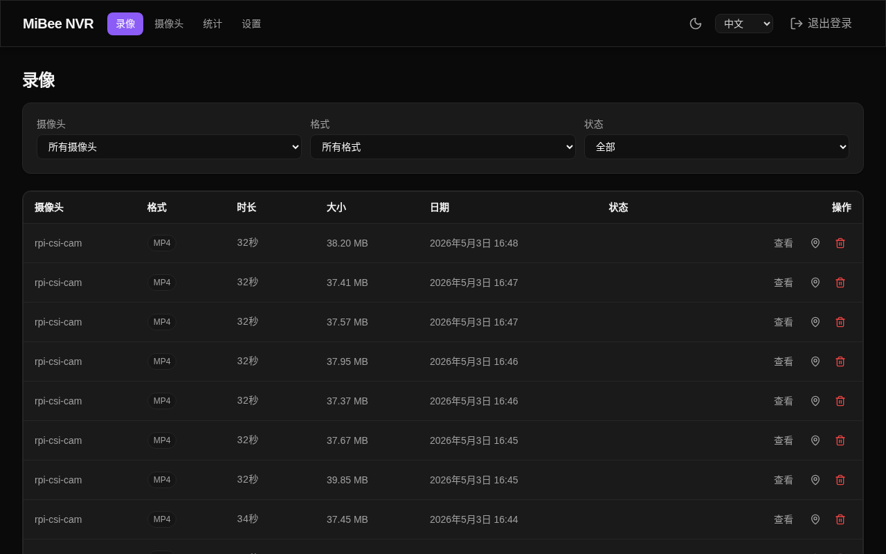
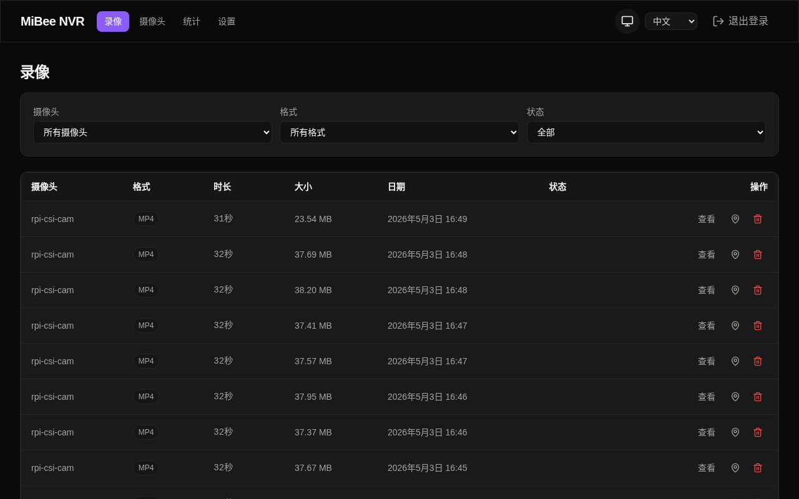
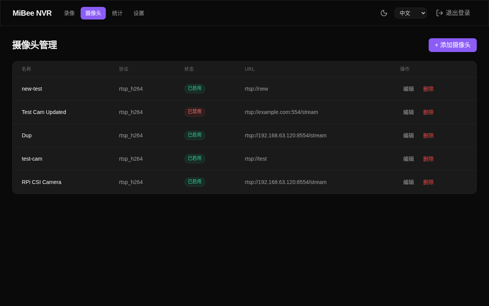
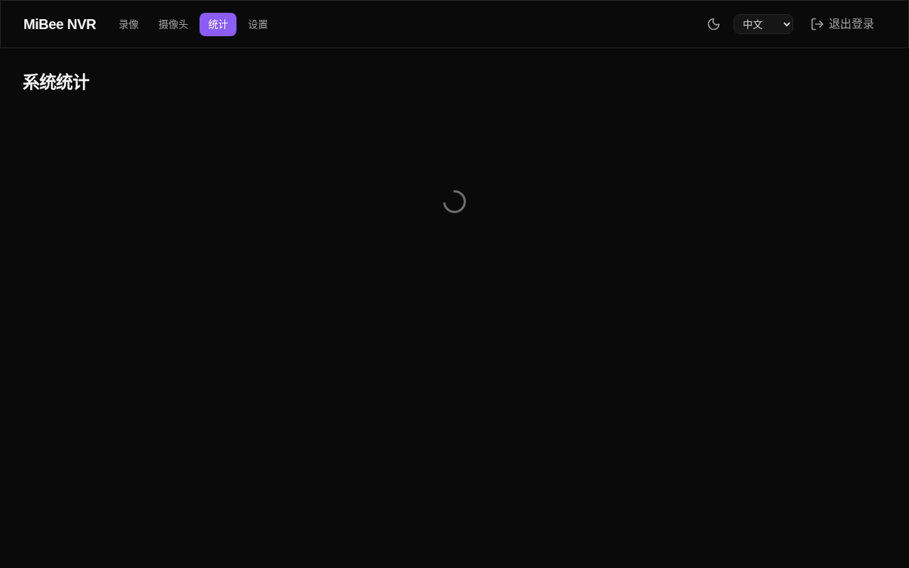
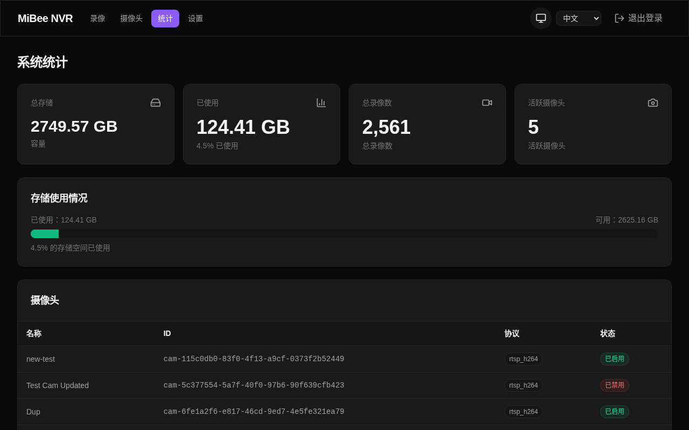
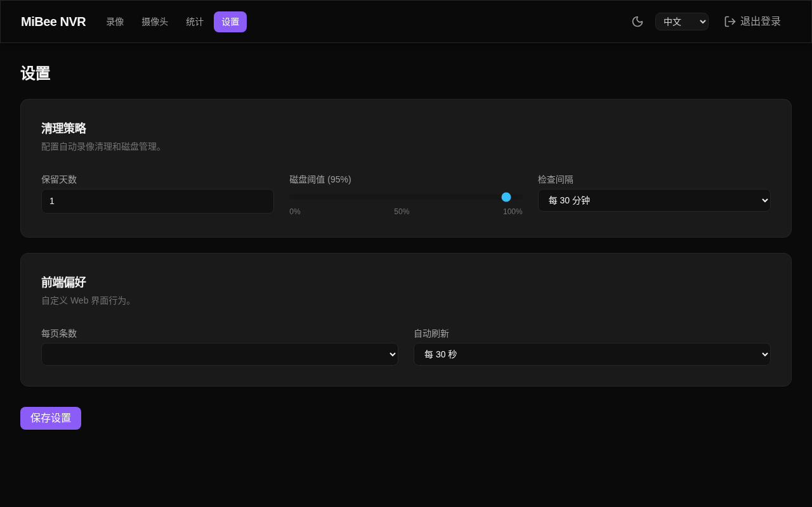

# MiBee NVR

A lightweight Network Video Recorder (NVR) written in Go. Supports RTSP (H.264/H.265/MJPEG) and HTTP JPEG cameras, with a built-in Web UI, WebDAV, FTP, and MQTT integration. Compiles to a single static binary with an embedded SPA frontend.

[**中文**](README.zh.md)

## Screenshots








## Features

- RTSP (H.264/H.265/MJPEG), HTTP JPEG, and ONVIF camera support
- Automatic MP4 segment recording
- Web UI with **dark/light theme** (auto-detects system preference)
- **Chart.js-powered** storage trends and per-camera statistics
- **Live view (HLS streaming)** - On-demand H.264/H.265 live streaming via Web UI
- **lucide-svelte** icons throughout the interface
- **i18n** support: English/Chinese language switching
- **Responsive design** for mobile and desktop
- WebDAV (configurable read-only/read-write) and FTP file access
- MQTT trigger-based recording for smart home integration
- Multi-camera concurrent recording
- **Per-camera retention_days** - Each camera can have its own retention policy
- Automatic cleanup with retention and disk threshold policies
- **Segment merging** — Configurable auto-merge with global + per-camera settings, dashboard monitoring
- SQLite metadata storage
- Single static binary, no external dependencies (`CGO_ENABLED=0`)
## Quick Start

### Option 1: Pre-built Binary (Recommended)

Download the latest binary from [GitHub Releases](https://github.com/Mi-Bee-Studio/MiBeeNvr/releases):

```bash
# AMD64 (most PCs/servers)
wget https://github.com/Mi-Bee-Studio/MiBeeNvr/releases/latest/download/mibee-nvr-amd64
chmod +x mibee-nvr-amd64

# ARM64 (Raspberry Pi, etc.)
wget https://github.com/Mi-Bee-Studio/MiBeeNvr/releases/latest/download/mibee-nvr-arm64
chmod +x mibee-nvr-arm64
```

Initialize config and start:

```bash
./mibee-nvr-amd64 init --password yourpassword
./mibee-nvr-amd64 -config mibee-nvr.yaml
```

Open `http://localhost:9090` to access the Web UI.

### Option 2: Docker

```bash
mkdir -p data
cp config.example.yaml data/mibee-nvr.yaml
# Edit data/mibee-nvr.yaml — set password, add cameras
docker compose up -d
```

Open `http://localhost:9090` to access the Web UI. See [`docker-compose.yml`](docker-compose.yml) for details.

### Option 3: One-click Install

```bash
curl -fsSL https://raw.githubusercontent.com/Mi-Bee-Studio/MiBeeNvr/main/install.sh | sudo bash
```

This downloads the binary, creates a system user (`nvr`), generates config, installs a systemd service, and starts it. Data directory: `/var/lib/mibee-nvr`.

### Option 4: Build from Source

```bash
git clone https://github.com/Mi-Bee-Studio/MiBeeNvr.git
cd MiBeeNvr
make build
./mibee-nvr init --password yourpassword
./mibee-nvr -config mibee-nvr.yaml
```

For detailed setup, see [Getting Started](docs/en/getting-started.md).

## Documentation

| Document | Description |
|----------|-------------|
| [Getting Started](docs/en/getting-started.md) | Installation, first camera setup |
| [Configuration](docs/en/configuration.md) | Full config reference |
| [API Reference](docs/en/api-reference.md) | REST API documentation |
| [MediaMTX Guide](docs/en/mediamtx-guide.md) | MediaMTX integration for CSI cameras |
| [Deployment](docs/en/deployment.md) | systemd, reverse proxy, cross-compile |

```bash
make build              # Local build (current architecture)
make cross              # Cross-compile ARM64 binary
make test               # Run tests
make lint               # Run linter
```

## Docker Container Images

For quick deployment, see [`docker-compose.yml`](docker-compose.yml):

```bash
docker compose up -d
```

Two build methods are available:

- **Multi-stage build** (`Dockerfile`): Compiles frontend + backend inside the container. Requires network to pull base images.
- **Cross-compile build** (`Dockerfile.arm64`): Cross-compiles on the host, packages with `scratch` base image. No QEMU needed.

```bash
# Build amd64 image (multi-stage)
make docker-build

# Build arm64 image (host cross-compile + scratch packaging)
make docker-build-arm64

# Build all architectures
make docker-build-all

# Push to registry (requires docker/podman login first)
make docker-push              # Push amd64
make docker-push-arm64        # Push arm64
make docker-push-all          # Push all

# Build and push in one shot
make docker-release
```

Image version is derived from git short SHA (e.g. `0c7e0eb`):

| Image | Architecture | Base Image |
|-------|-------------|------------|
| `registry.cn-hangzhou.aliyuncs.com/mickeybeehome/mibee-nvr:<SHA>` | amd64 | distroless |
| `registry.cn-hangzhou.aliyuncs.com/mickeybeehome/mibee-nvr:<SHA>-arm64` | arm64 | scratch |

## Project Structure

```
cmd/mibee-nvr/       # Entry point
internal/            # Core packages
  api/               # REST API handlers
  camera/            # Camera manager
  recorder/          # H.264/H.265/MJPEG recording engines
  hls/               # HLS streaming manager
  storage/           # SQLite DB + file manager
  config/            # YAML config
  middleware/        # Auth middleware
  muxer/             # MP4 muxer
  ftp/               # FTP server
  webdav/            # WebDAV server (configurable read-only/read-write)
  mqtt/              # MQTT client
  ui/                # Embedded web UI
web/                 # Svelte 5 frontend
deploy/              # systemd services
docs/                # Documentation (EN/ZH)
```

## Contributing

1. Run `make lint` before submitting
2. Add tests for new features
3. Write clear commit messages

## License

[MIT License](LICENSE) © Mi&Bee Studio
