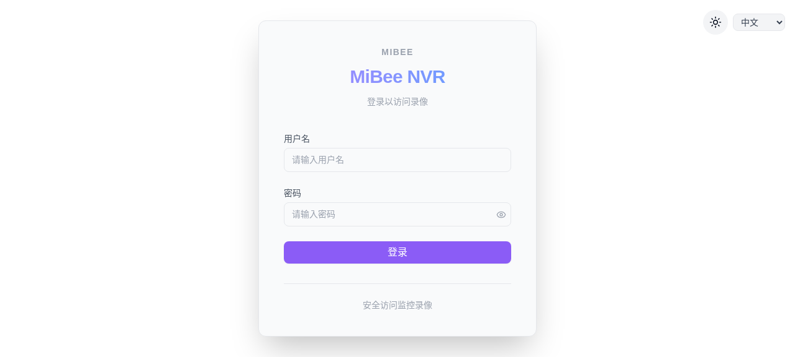
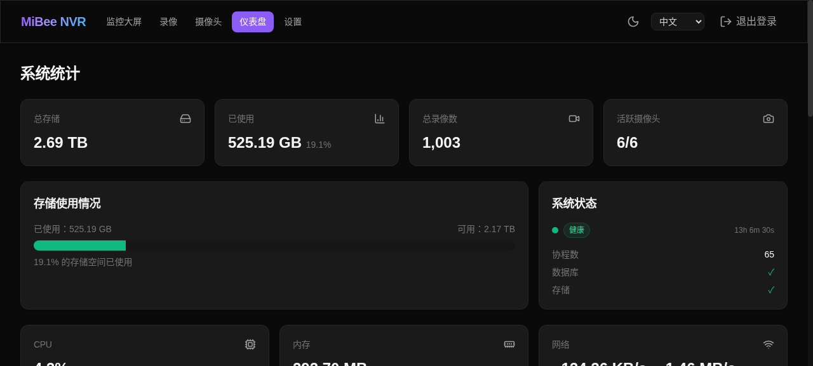
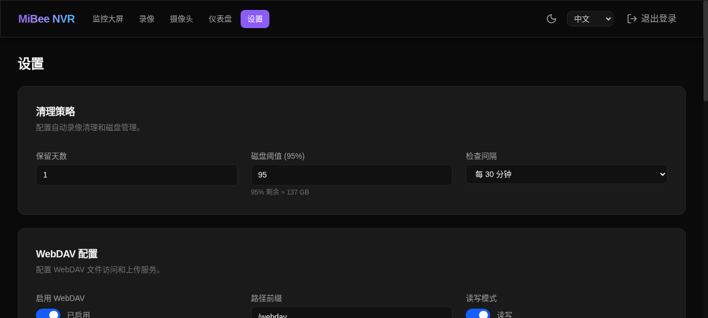

# MiBee NVR
[](https://github.com/Mi-Bee-Studio/MiBeeNvr/releases)
[](https://github.com/Mi-Bee-Studio/MiBeeNvr/actions/workflows/ci.yml)
[](https://go.dev/)
[](https://svelte.dev/)
[](https://www.sqlite.org/)
[](https://www.docker.com/)
[](https://www.raspberrypi.com/)
[](LICENSE)

> **Turn any Raspberry Pi into a professional NVR in 60 seconds.**  
> Single binary, zero dependencies, no cloud required. Runs on Raspberry Pi 3B with 512MB memory budget.

> [**中文**](README.zh.md) — [English](README.md)

## Quick Start

### One-click Install (Recommended)

```bash
curl -fsSL https://raw.githubusercontent.com/Mi-Bee-Studio/MiBeeNvr/main/install.sh | sudo bash
```

Downloads the binary, creates a system user (`nvr`), generates a config, installs a systemd service, and starts it. Data directory: `/var/lib/mibee-nvr`.

### Option 1: Pre-built Binary

Download the latest binary from [GitHub Releases](https://github.com/Mi-Bee-Studio/MiBeeNvr/releases):

```bash
# AMD64 (most PCs/servers)
wget https://github.com/Mi-Bee-Studio/MiBeeNvr/releases/latest/download/mibee-nvr-amd64
chmod +x mibee-nvr-amd64

# ARM64 (Raspberry Pi 4/5, etc.)
wget https://github.com/Mi-Bee-Studio/MiBeeNvr/releases/latest/download/mibee-nvr-arm64
chmod +x mibee-nvr-arm64

# ARMv7 (Raspberry Pi 2/3, etc.)
wget https://github.com/Mi-Bee-Studio/MiBeeNvr/releases/latest/download/mibee-nvr-armv7
chmod +x mibee-nvr-armv7
```

Initialize config and start:

```bash
./mibee-nvr-amd64 init --password yourpassword
./mibee-nvr-amd64 -config mibee-nvr.yaml
```

Open `http://localhost:9090` to access the Web UI.

### Option 2: Docker

```bash
docker compose up -d
```

Open `http://localhost:9090` to access the Web UI.

To store recordings on an external drive, edit the volume mount in `docker-compose.yml`:

```yaml
    volumes:
      - /mnt/external/nvr:/data    # ← change to your host path
    environment:
      - NVR_DATA_DIR=/data          # must match the volume mount
```

### Option 3: Build from Source

```bash
git clone https://github.com/Mi-Bee-Studio/MiBeeNvr.git
cd MiBeeNvr
make build
./mibee-nvr init --password yourpassword
./mibee-nvr -config mibee-nvr.yaml
```

For detailed setup, see [Getting Started](docs/en/getting-started.md).

## Why MiBee NVR?

- **Single Binary**: Zero dependencies, embedded Svelte 5 SPA, `CGO_ENABLED=0`
- **Raspberry Pi 3B Ready**: Runs on 1GB RAM with 512MB memory budget
- **Multi-Protocol Streaming**: HLS, WebRTC, HTTP-FLV, RTMP, SRT, WebSocket
- **No Cloud Required**: Self-hosted, no subscriptions, no vendor lock-in
- **Modern Web UI**: Dark/light themes, i18n support, responsive design
- **ONVIF Support**: Auto-discovery, PTZ control, stream URI management
- **Smart Integrations**: MQTT triggers, WebDAV, FTP, FFmpeg transcoding

## Screenshots

  
*Login page with dark/light theme toggle and authentication*

  
*Dashboard with live camera feeds, recording status, and system metrics*

  
*Settings panel for camera configuration and system management*

## Features

### 📷 Camera Support
- RTSP (H.264/H.265/MJPEG) streaming
- HTTP JPEG snapshot streaming
- ONVIF discovery & management with PTZ control
- Xiaomi CS2 P2P protocol support

### 📺 Streaming & Live View
- HLS on-demand streaming with LL-HLS support
- WebRTC WHEP for sub-second latency viewing
- HTTP-FLV for browser-friendly streaming
- RTMP ingest server for push/pull workflows
- SRT low-latency transport receiver
- WebSocket real-time binary frame streaming

### 💾 Recording & Storage
- Automatic MP4 segment generation
- Multi-camera concurrent recording
- Per-camera retention policies
- Audio capture (AAC + G.711)
- Segment merging with configurable policies
- Periodic timelapse recording

### 🔧 Management
- Modern Svelte 5 web UI with dark/light themes
- REST API for automation
- BasicAuth with bcrypt password hashing
- Prometheus metrics integration
- Atomic configuration with validation

### 🤖 Smart Features
- AI detection with ONNX Runtime inference
- Multi-layer camera health monitoring
- Auto-remediation for connection issues
- SSE-based real-time event system
- Quality scoring and alerting

### 🔌 Integrations
- MQTT trigger-based recording
- WebDAV server for file access
- FTP server for remote uploads
- FFmpeg hardware transcoding
- Event-driven architecture

## Supported Protocols

| Protocol | Direction | Status | Notes |
|----------|----------|---------|-------|
| RTSP | Camera → NVR | ✅ Done | H.264/H.265/MJPEG support |
| HTTP JPEG | Camera → NVR | ✅ Done | Snapshot streaming |
| HLS | NVR → Browser | ✅ Done | On-demand streaming |
| WebRTC | NVR → Browser | ✅ Done | WHEP sub-second latency |
| HTTP-FLV | NVR → Browser | ✅ Done | Browser-friendly streaming |
| RTMP | Camera → NVR | ✅ Done | Push/pull support |
| SRT | Camera → NVR | ✅ Done | Low-latency transport |
| ONVIF | Camera ↔ NVR | ✅ Done | Discovery, PTZ, stream URI |
| Xiaomi CS2 | Camera → NVR | ✅ Done | P2P protocol, cloud auth |

## Use Cases

### 🏠 Home Security
Monitor your property with multiple cameras. Motion-triggered recording, smartphone alerts, and easy remote viewing from anywhere.

### 🏪 Small Business
Affordable security system for shops, offices, and warehouses. Multi-camera support with individual retention policies.

### 🔧 DIY/Tinkering
Perfect for homelab enthusiasts. Self-hosted, no subscriptions, works with any RTSP camera and integrates with smart home systems.

## Documentation

| Document | Description |
|----------|-------------|
| [Getting Started](docs/en/getting-started.md) | Installation, first camera setup |
| [Configuration](docs/en/configuration.md) | Full config reference |
| [API Reference](docs/en/api/README.md) | REST API documentation |
| [MediaMTX Guide](docs/en/mediamtx-guide.md) | MediaMTX integration for CSI cameras |
| [Deployment](docs/en/deployment.md) | systemd, reverse proxy, cross-compile |
| [Xiaomi Setup](docs/en/xiaomi-setup.md) | Xiaomi cloud camera integration |
| [ONVIF Guide](docs/en/onvif-guide.md) | ONVIF camera setup, PTZ control, troubleshooting |
| [Camera Guide](docs/en/camera-guide.md) | Camera setup, protocols, troubleshooting |
| [FTP Integration](docs/en/ftp-integration.md) | FTP file access setup |
| [MQTT Integration](docs/en/mqtt-integration.md) | MQTT smart home integration |
| [WebDAV Integration](docs/en/webdav-integration.md) | WebDAV file access setup |
| [Troubleshooting](docs/en/troubleshooting.md) | Common issues and solutions |
| [Transcoding](docs/en/transcoding.md) | FFmpeg transcoding setup |

## Build & Deploy

```bash
# Build for current architecture
make build

# Cross-compile for ARM64 (Raspberry Pi)
make cross

# Run tests
make test

# Build Docker images
make docker-build       # Multi-stage build
make docker-build-arm64 # Cross-compile + scratch
make docker-build-all   # All architectures
```

Docker deployment:
```bash
docker compose up -d
```

Images published to `ghcr.io/mi-bee-studio/mibeenvr` with tags: `latest`, `v1.2.3`, `sha-abc1234`

## Project Structure

```
cmd/mibee-nvr/       # CLI entry point + app lifecycle
internal/            # Core packages (29 Go modules)
web/                # Svelte 5 SPA frontend
deploy/             # systemd services, Caddyfile
docs/               # Bilingual documentation (EN/ZH)
tests/              # Integration tests
e2e-tests/         # Playwright E2E tests
```

For full project details, see [AGENTS.md](AGENTS.md).

## Contributing

1. Run `make lint` before submitting
2. Add tests for new features
3. Write clear commit messages

## License

[MIT License](LICENSE) © Mi&Bee Studio