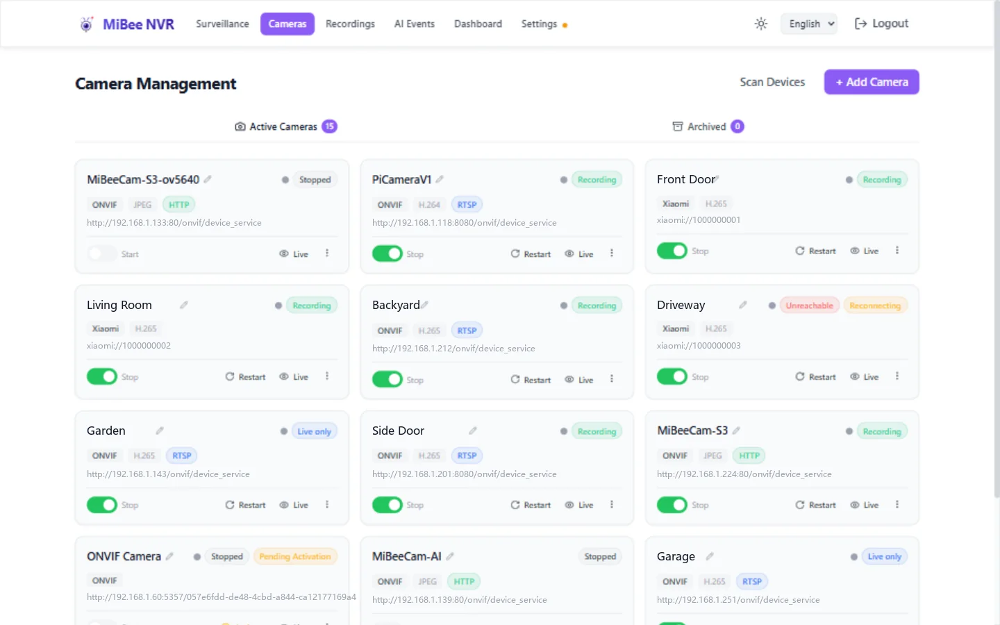
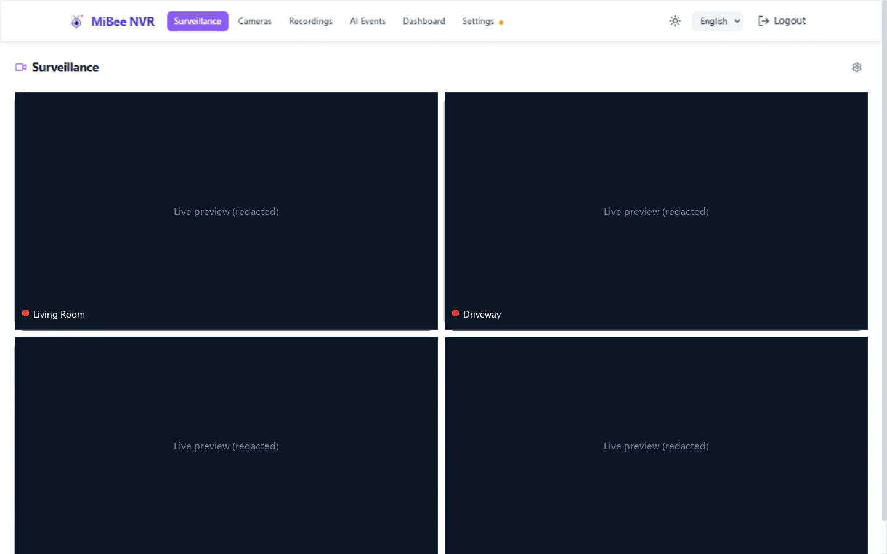

# Getting Started with MiBee NVR

## What is MiBee NVR

MiBee NVR is a lightweight Network Video Recorder written in Go. It records video feeds from IP cameras to MP4 segments on disk and provides a web interface for viewing recordings, managing cameras, and accessing recorded footage.

**Key Features:**

- Records RTSP (H.264, H.265, MJPEG), HTTP JPEG, ONVIF, Xiaomi (CS2/TUTK P2P), GB/T 28181, SRT/RTMP push-in, and Timelapse cameras to MP4 segments
- Web UI with dark/light theme, multi-protocol live view (HLS, WebRTC, HTTP-FLV, WebSocket), and Chart.js statistics
- Continuous playback: double-buffered seamless segment chaining + an on-demand fMP4 full-day VOD timeline (scrub across recordings and gaps)
- LAN discovery: mDNS `_mibee-nvr._tcp` announcement + UDP 49090 broadcast responder; `/api/health` exposes a stable `device_id`
- WebDAV (configurable read-only/read-write) and FTP access to recordings
- MQTT integration for event-driven recording
- Segment merging to reduce file count
- Single static binary with embedded web interface — no dependencies

## Quick Start (5 Minutes)

### Option 1: Pre-built Binary (Recommended)

Download the latest binary for your architecture from [GitHub Releases](https://github.com/Mi-Bee-Studio/MiBeeNvr/releases):

```bash
# AMD64 (most PCs/servers)
wget https://github.com/Mi-Bee-Studio/MiBeeNvr/releases/latest/download/mibee-nvr-amd64
chmod +x mibee-nvr-amd64

# ARM64 (Raspberry Pi, etc.)
wget https://github.com/Mi-Bee-Studio/MiBeeNvr/releases/latest/download/mibee-nvr-arm64
chmod +x mibee-nvr-arm64
```

Initialize config and start:

```bash
./mibee-nvr-amd64 init --password yourpassword
./mibee-nvr-amd64 -config mibee-nvr.yaml
```

Open http://localhost:9090 in your browser.

### Option 2: Docker

```bash
docker compose --project-directory . -f deploy/docker/docker-compose.yml up -d
```

Open http://localhost:9090 in your browser.

> **Note**: No config preparation needed! MiBee NVR auto-initializes when started without a config file.

> **Running on a NAS (Synology / QNAP / unRAID / fnOS / iStoreOS / 极空间)?** See the per-platform guides in the [Deployment Guide](deployment.md#deploying-on-a-nas-os) — they cover host networking (required for ONVIF camera auto-discovery), volume paths, and port conflicts.


#### Changing the Storage Location

By default, recordings are stored in `./data` on the host (mapped to `/data` inside the container).
To store recordings on an external drive or a different directory, edit `docker-compose.yml`:

```yaml
    volumes:
      - /mnt/external/nvr:/data    # ← change to your host path
    environment:
      - NVR_DATA_DIR=/data          # must match the right side of the volume mount
      # - NVR_UID=1000               # match the UID that owns the host directory
      # - NVR_GID=1000               # match the GID that owns the host directory
```

> **Important**: The right side of the volume mount (`:data`) and `NVR_DATA_DIR` must always match.
> If the container fails to start or keeps restarting, check that the host directory exists and is
> writable by the configured UID/GID (default: 1000:1000).

### Option 3: One-click Install Script

```bash
curl -fsSL https://raw.githubusercontent.com/Mi-Bee-Studio/MiBeeNvr/main/install.sh | sudo bash
```

This downloads the binary, creates a system user (`nvr`), generates config with password, installs a systemd service, and starts it automatically. Data directory: `/var/lib/mibee-nvr`.

To uninstall (preserves recordings):

```bash
curl -fsSL https://raw.githubusercontent.com/Mi-Bee-Studio/MiBeeNvr/main/install.sh | sudo bash -s -- --uninstall
```

### Option 4: Build from Source

Requires Go 1.26+ and Node.js (for frontend):

```bash
git clone https://github.com/Mi-Bee-Studio/MiBeeNvr.git
cd MiBeeNvr
make build
./mibee-nvr init --password yourpassword
./mibee-nvr -config mibee-nvr.yaml
```

For cross-compiling to ARM64 (e.g. Raspberry Pi):

```bash
make cross
```

## First-Time Setup

### Using `mibee-nvr init`

The `init` subcommand creates a config file with secure defaults:

```bash
./mibee-nvr init --password yourpassword
```

Options:

| Flag | Default | Description |
|------|---------|-------------|
| `--password` | (prompted) | Admin password for Web UI |
| `--username` | `admin` | Admin username |
| `--data-dir` | `/var/lib/mibee-nvr` | Data directory for recordings and DB |
| `--listen` | `:9090` | HTTP listen address |
| `--config` | `mibee-nvr.yaml` | Config file path |
| `--force` | false | Overwrite existing config |

### Password Setup

There are three ways to set the admin password:

1. **`mibee-nvr init --password <pw>`** — sets the hashed password during setup (recommended)
2. **Plaintext in config** — set `auth.password` in YAML; auto-hashed to `password_hash` on first start
3. **Manual hash** — generate with `mibee-nvr hash-password <pw>` and paste into `auth.password_hash`

### Default Paths

| Path | Description |
|------|-------------|
| `/var/lib/mibee-nvr/` | Data directory (recordings, database) |
| `/var/lib/mibee-nvr/mibee-nvr.db` | SQLite database |
| `mibee-nvr.yaml` | Configuration file |

## Adding Your First Camera





MiBee NVR uses a **separate transport + encoding** format for camera protocols:

- **Transport**: `rtsp`, `http`, `onvif`, `xiaomi`, `timelapse`
- **Encoding**: `h264`, `h265`, `mjpeg`, `jpeg`

> The old combined format (`rtsp_h264`, `rtsp_h265`, `rtsp_mjpeg`, `http_jpeg`) is **rejected in 0.10.0+** — `Validate()` and the camera create handler return an error asking you to split into separate `protocol` and `encoding` fields.

### RTSP H.264 Camera

```yaml
cameras:
  - id: "front-door"
    name: "Front Door"
    protocol: "rtsp"
    encoding: "h264"
    url: "rtsp://192.168.1.100:554/stream"
    enabled: true
```

### RTSP H.265 Camera

```yaml
cameras:
  - id: "driveway"
    name: "Driveway"
    protocol: "rtsp"
    encoding: "h265"
    url: "rtsp://192.168.1.103:554/stream"
    enabled: true
```

### HTTP JPEG Camera

```yaml
cameras:
  - id: "garage"
    name: "Garage"
    protocol: "http"
    encoding: "jpeg"
    url: "http://192.168.1.102:8080/snapshot"
    enabled: true
```

### ONVIF Camera

```yaml
cameras:
  - id: "lobby"
    name: "Lobby"
    protocol: "onvif"
    url: "http://192.168.1.104:80/onvif/device_service"
    username: "admin"
    password: "camera123"
    enabled: true
```

> ONVIF auto-detects the encoding. The `encoding` field can be omitted.

### Timelapse Camera

```yaml
cameras:
  - id: "construction"
    name: "Construction Site"
    protocol: "timelapse"
    enabled: true
```

> Timelapse cameras capture periodic snapshots without a continuous video stream.

### Combined Format Is Deprecated

> ⚠️ **Combined formats (e.g. `rtsp_h264`) are rejected since 0.10.0.** If you are upgrading from an older version and your config still uses a combined format, you must split it into separate `protocol` + `encoding` fields, otherwise NVR startup fails validation.

**Wrong (old):** `protocol: "rtsp_h264"`
**Correct (new):**

```yaml
cameras:
  - id: "cam1"
    name: "Legacy Cam"
    protocol: "rtsp"
    encoding: "h264"
    url: "rtsp://192.168.1.100:554/stream"
    enabled: true
```

After editing the config, restart MiBee NVR or use the Web UI to add cameras at runtime.

## Accessing MiBee NVR

### Web UI

Open http://your-server:9090 and log in with your configured credentials. From the Web UI you can:

- View live camera streams (HLS, WebRTC, HTTP-FLV, WebSocket)
- Play back and download recordings
- Add, edit, and remove cameras
- View storage statistics and trends
- Configure settings

### WebDAV

WebDAV is available at `/dav/` (enabled by default, read-only by default):

```bash
curl -u admin:password http://your-server:9090/dav/
```

Mount in a file manager: `davs://your-server:9090/dav/`

To enable read-write access, set `webdav.read_write: true` in config.

### FTP

FTP is available on port 2121 (enabled by default):

```bash
ftp your-server 2121
# Username: admin
# Password: (your password)
```

## Common Issues

### Service won't start

- Check config file syntax: `cat mibee-nvr.yaml`
- Verify the data directory exists and is writable: `ls -la /var/lib/mibee-nvr/`
- Check logs: `journalctl -u mibee-nvr -f`

### Permission errors

- The `install.sh` script creates a `nvr` system user. Make sure the data directory is owned by it:
  `sudo chown -R nvr:nvr /var/lib/mibee-nvr/`

### Port conflicts

- Default port is 9090. If it's in use, change `server.listen` in config (e.g. `":8080"`). You can also override the listen port without editing config via the `NVR_LISTEN_PORT` environment variable (e.g. `NVR_LISTEN_PORT=8080`), the `install.sh --port <port>` flag, or the Web UI Settings page.

### Can't connect to camera

- Verify the camera URL works with VLC or ffplay: `ffplay rtsp://192.168.1.100:554/stream`
- Check network connectivity: `ping 192.168.1.100`
- Ensure camera credentials are correct
- Check if the camera requires a specific sub-stream URL for H.265

### High memory usage on Raspberry Pi

- Reduce `segment_duration` to `30s` (default). Longer durations hold more data in RAM.
- The RPi 3B has ~900MB RAM. With 4 cameras at 30s segments, expect ~300MB stable usage.
