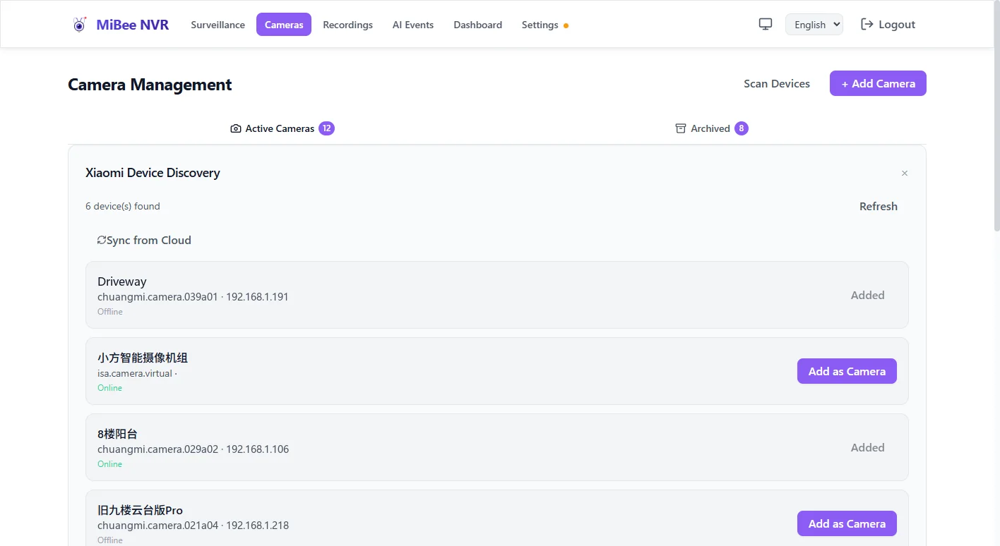

# Xiaomi Camera Integration

MiBee NVR provides comprehensive support for Xiaomi cloud cameras through the CS2/TUTK P2P protocol. Xiaomi's cloud services handle account authentication and device/connection-URL resolution; however, **when streaming, the NVR connects directly to the camera's LAN IP over UDP (P2P)**. The NVR and the camera must therefore be on the same local network (same subnet, UDP-reachable), with no firewall or AP isolation blocking the traffic — otherwise the camera stays stuck on "connecting".

## Overview

- **Protocol**: CS2 P2P / TUTK (Xiaomi's proprietary cloud protocol)
- **Authentication**: Xiaomi cloud services with token-based auth
- **Supported Models**: CS2 and TUTK cameras (see table below)
- **Features**: Live streaming, recording, snapshots, PTZ control
- **Network**: Requires connectivity to Xiaomi cloud services **and the NVR on the same LAN as the camera** (auth via cloud, streaming via LAN P2P)

## Prerequisites

- Xiaomi account with registered cameras
- Cameras bound to your Xiaomi account in Mi Home app
- Network access to Xiaomi cloud services (`api.io.mi.com`)
- Working internet connection for NVR system
- **NVR and camera on the same local network** (same subnet, UDP-reachable) — streaming is a direct LAN P2P connection; different networks cause a permanent "connecting" state

| Model | Identifier | Protocol | Support Level | Notes |
|-------|------------|----------|---------------|-------|
| **Xiaomi C200** | `chuangmi.camera.046c04` | CS2 P2P | ✅ Full | HD 1080p indoor camera |
| **Xiaomi C300** | `chuangmi.camera.72ac1` | CS2 P2P | ✅ Full | 2K indoor camera |
| **Xiaofang** | `isa.camera.isc5c1` | TUTK | ✅ Full | Pan/tilt dome camera (legacy) |
| **Loock V1** | `loock.cateye.v01` | TUTK | ✅ Full | Smart doorbell camera (legacy) |
| **Loock V2** | `loock.cateye.v02` | CS2 P2P | ✅ Full | Smart doorbell camera |
| **Dafang** | `isa.camera.df3` | TUTK | ✅ Full | Pan/tilt dome camera (legacy) |
| **Aqara G2** | `lumi.camera.gwagl01` | TUTK | ✅ Full | Indoor cube camera (legacy) |
| **IMILAB A1** | `chuangmi.camera.ipc019e` | TUTK | ✅ Full | Indoor camera (legacy) |
| **Xiaobai** | `chuangmi.camera.xiaobai` | TUTK | ✅ Full | Pan/tilt camera (legacy) |
| **Mijia** | `chuangmi.camera.v2` | TUTK | ✅ Full | Basic indoor camera (legacy) |

**Important**: Both CS2 and TUTK protocol cameras are now supported. TUTK models use the legacy protocol via `internal/tutk/`. Two-way audio is available for TUTK models only (CS2 models are blocked because two-way audio requires the TUTK transport).
## Configuration

### Basic Configuration

```yaml
xiaomi:
  user_id: "123456789"
  token: "your_passToken_here"
  region: "cn"

cameras:
  - id: "xiaomi_c200_front"
    name: "Xiaomi C200 - Front"
    protocol: "xiaomi"
    encoding: "h264"
    did: "device_id_here"
    vendor: "cs2"
    enabled: true
    # Optional settings
    sub_stream_url: "rtsp://xiaomi-c200-cs2.stream"
    hls_max_fps: 15
    sample_interval: 2
```

### Configuration Options

| Field | Required | Type | Default | Description |
|-------|----------|------|---------|-------------|
| `user_id` | Yes | string | - | Xiaomi user ID (written automatically after the first `/api/xiaomi/auth` login) |
| `token` | Yes | string | - | Xiaomi passToken |
| `region` | No | string | "cn" | Region code (cn, sg, de, etc.) |

> The `xiaomi:` section has no on/off switch — integration is active whenever credentials are configured. LAN auto-discovery is controlled by the top-level [`auto_discover`](./configuration.md) setting and is separate from Xiaomi-account discovery (the Web UI scan panel).

### Camera Configuration Options

| Field | Required | Type | Default | Description |
|-------|----------|------|---------|-------------|
| `id` | Yes | string | - | Unique camera identifier |
| `name` | Yes | string | - | Display name for camera |
| `protocol` | Yes | string | "xiaomi" | Must be "xiaomi" |
| `encoding` | Yes | string | "h264" | Video encoding (h264, h265) |
| `did` | Yes | string | - | Xiaomi device ID |
| `vendor` | No | string | "cs2" | Transport implementation ("cs2"; legacy TUTK models are selected automatically) |
| `channel` | No | string | "" | Dual-lens camera lens selection ("" or "0" = main lens, "1" = secondary) |
| `quality` | No | string | "auto" | Stream quality ("auto" = HD with SD fallback, "hd", "sd") |
| `enabled` | No | boolean | true | Enable camera recording |

### Advanced Configuration

```yaml
xiaomi:
  user_id: "123456789"
  token: "your_passToken_here"
  region: "cn"

cameras:
  - id: "xiaomi_c300_living_room"
    name: "Living Room Camera"
    protocol: "xiaomi"
    encoding: "h264"
    did: "device_id_12345"
    vendor: "cs2"
    channel: "0"            # dual-lens camera: main lens ("1" = secondary)
    quality: "auto"         # automatic HD → SD fallback
    enabled: true
    # Optimized settings for 2K cameras
    hls_max_fps: 20
    sample_interval: 1
    # Stream health / watchdog (optional)
    frame_watchdog_timeout: "30s"
```

> Xiaomi integration has no dedicated timeout/retry/concurrency options; connection behavior is managed by
> the transport layer (CS2/TUTK), and unhealthy streams are handled by the camera-level
> `frame_watchdog_timeout` and `health_overrides` (see [configuration.md](./configuration.md)).
> For snapshots/timelapse use the `timelapse:` section (see [timelapse.md](./timelapse.md)) — there are no
> `snapshot_interval` / `motion_detection` / `push_notifications` keys: the NVR itself does not perform motion
> detection; alerting comes from AI-backend events.

## Setup Methods

### Method 1: Web UI Setup (Recommended)

1. **Access Web UI**: Open MiBee NVR Web Interface at `http://localhost:9090`

2. **Navigate to Cameras**: Go to the Cameras page

3. **Xiaomi Discovery**: Expand the "Xiaomi Device Discovery" section

4. **Authenticate**: Enter your Xiaomi account credentials and click "Sign In"

5. **Select Devices**: Browse the discovered devices and select cameras you want to add

6. **Add to NVR**: Click "Add to NVR" for each selected camera



7. **Configure**: Customize settings for each camera (retention, quality, etc.)

8. **Save**: Click "Save Configuration" to apply changes

### Method 2: API Authentication

Use the API to get authentication credentials programmatically:

```bash
# Authenticate with Xiaomi cloud
curl -X POST http://localhost:9090/api/xiaomi/auth \
  -H "Content-Type: application/json" \
  -d '{"username": "your-email@example.com", "password": "your-password"}'

# Response example:
{
  "success": true,
  "user_id": "123456789",
  "pass_token": "your_passToken_here",
  "devices": [
    {
      "did": "device_id_12345",
      "name": "Xiaomi C200",
      "model": "chuangmi.camera.046c04",
      "online": true
    }
  ]
}
```

### Method 3: Manual Configuration

Edit the configuration file directly:

```yaml
xiaomi:
  enabled: true
  user_id: "123456789"
  token: "your_passToken_here"
  region: "cn"

cameras:
  - id: "xiaomi_c200_front"
    name: "Xiaomi C200 - Front"
    protocol: "xiaomi"
    encoding: "h264"
    did: "device_id_12345"
    vendor: "cs2"
    enabled: true
```

## API Endpoints

### Xiaomi Authentication

**POST** `/api/xiaomi/auth`
- **Body**: `{username: string, password: string}`
- **Response**: User info and device list
- **Description**: Authenticate with Xiaomi cloud and get credentials

```bash
curl -X POST http://localhost:9090/api/xiaomi/auth \
  -H "Content-Type: application/json" \
  -d '{"username": "user@example.com", "password": "password"}'
```

### Device Management

**GET** `/api/xiaomi/devices`
- **Response**: List of all Xiaomi devices
- **Description**: Get all Xiaomi devices associated with the account

```bash
curl -u admin:password http://localhost:9090/api/xiaomi/devices
```

**POST** `/api/xiaomi/sync`
- **Response**: Sync status
- **Description**: Force sync devices from Xiaomi cloud

```bash
curl -X POST -u admin:password http://localhost:9090/api/xiaomi/sync
```

### Camera Control

**GET** `/api/cameras/{camera_id}`
- **Response**: Camera details (including status)
- **Description**: Get current camera status (generic camera endpoint; the old `/api/xiaomi/cameras/{id}/status` has been removed)

```bash
curl -u admin:password http://localhost:9090/api/cameras/cam-xxxx
```

**POST** `/api/cameras/{camera_id}/ptz/move`
- **Body**: `{"mode": "continuous", "pan": number, "tilt": number, "zoom": number}`
- **Description**: PTZ jog (unified endpoint — see the "PTZ Control" chapter below; the old `/api/xiaomi/cameras/{id}/ptz` has been removed)

```bash
curl -X POST -u admin:password \
  -H "Content-Type: application/json" \
  -d '{"mode":"continuous","pan":0,"tilt":0.5,"zoom":0}' \
  http://localhost:9090/api/cameras/cam-xxxx/ptz/move
```

### Snapshot Management

**GET** `/api/cameras/{camera_id}/snapshot`
- **Response**: JPEG image data
- **Description**: Take a snapshot from the camera (generic camera endpoint; returns 404 when no snapshot is available)

```bash
curl -u admin:password -o snapshot.jpg \
  http://localhost:9090/api/cameras/cam-xxxx/snapshot
```

## Two-Way Audio

Two-way audio allows you to communicate through supported Xiaomi cameras. This feature is available for TUTK models only — it requires the TUTK transport, so CS2 cameras return `two-way audio requires TUTK transport` and are not supported.

### Prerequisites

- Browser with AudioWorklet support (Chrome, Firefox, Edge modern versions)
- Camera with two-way audio capability
- Network latency under 200ms for best experience

### Configuration

Enable two-way audio in your camera configuration:

```yaml
cameras:
  - id: "cam-xxxx"
    name: "Xiaomi C200 - Front"
    protocol: "xiaomi"
    encoding: "h264"
    url: "xiaomi://655448418"   # xiaomi://<device DID>
    two_way_audio_enabled: true  # Enable two-way audio
```

### Usage

1. **Access Live View**: Navigate to the camera's live view page
2. **Hold to Talk**: Click and hold the microphone button to speak
3. **Release to Listen**: Release the button to hear audio from the camera

### Technical Details

- Audio codec: G.711 μ-law/A-law (8kHz sample rate)
- Protocol: MISS protocol via CS2 P2P
- Latency: ~100-200ms (depends on network)
- Browser API: AudioContext, AudioWorklet for encoding

### Troubleshooting

- No audio: Check browser permissions for microphone access
- Echo: Use headphones instead of speakers
- Latency: Check network connectivity to Xiaomi cloud

## PTZ Control

Pan-tilt-zoom (PTZ) control is available for Xiaomi cameras with motor support. This includes most dome cameras (Xiaofang, Dafang, Xiaobai) and some indoor cameras.

Xiaomi cameras share the **unified PTZ endpoints** with ONVIF / GB28181 cameras, driven by velocity vectors: `pan`/`tilt`/`zoom` ∈ [-1, 1]. For Xiaomi cameras the dominant axis becomes the rotation direction and speed = magnitude × 10 (matching the Web UI speed selector's 0.25 / 0.5 / 1.0).

### Supported Actions

- `pan` / `tilt` — Directional pan/tilt (continuous velocity vectors; press to move, release to stop)
- `stop` — Stop movement (a move must be followed by a stop)
- `zoom` — **Not supported** on Xiaomi cameras (returns 400)

### API Usage

**POST** `/api/cameras/{camera_id}/ptz/move`
- **Body**: `{"mode": "continuous", "pan": number, "tilt": number, "zoom": number}`
- **Response**: `{"status": "ok"}`; 503 when the camera is offline; 400 for a non-zero zoom vector

**POST** `/api/cameras/{camera_id}/ptz/stop`
- **Response**: `{"status": "ok"}`

```bash
# Tilt up (0.5 = medium speed)
curl -X POST -u admin:password \
  -H "Content-Type: application/json" \
  -d '{"mode":"continuous","pan":0,"tilt":0.5,"zoom":0}' \
  http://localhost:9090/api/cameras/cam-xxxx/ptz/move

# Stop movement
curl -X POST -u admin:password \
  http://localhost:9090/api/cameras/cam-xxxx/ptz/stop
```

### Frontend Integration

The web UI provides on-screen PTZ controls for supported cameras. The controls automatically appear when:

- Camera model is recognized as PTZ-capable
- Camera reports motor support via GetDeviceInfo

## Device Info

You can query device information including firmware and hardware versions for Xiaomi cameras.

### API Usage

**GET** `/api/cameras/{camera_id}/xiaomi/device-info`
- **Response**: Device information JSON

```bash
curl -u admin:password http://localhost:9090/api/cameras/cam-xxxx/xiaomi/device-info
```

**Response Example**:

```json
{
  "model": "chuangmi.camera.046c04",
  "name": "Xiaomi C200",
  "firmware_version": "4.2.0_20231201",
  "hardware_version": "2.0",
  "mac_address": "AA:BB:CC:DD:EE:FF",
  "ip_address": "192.168.1.100",
  "online": true,
  "last_seen": "2024-01-15T10:30:00Z"
}
```

## Integration Examples

### Home Assistant Integration

```yaml
# Home Assistant configuration
homeassistant:
  # Xiaomi camera integration
  xiaomi:
    username: !secret xiaomi_username
    password: !secret xiaomi_password
    region: cn

# Camera entity in Home Assistant
camera:
  - platform: mjpeg
    name: "Xiaomi C200 Front"
    mjpeg_url: !secret xiaomi_c200_stream
    authentication: !secret xiaomi_auth

# Automation for motion detection
- id: "xiaomi_motion_alert"
  alias: "Xiaomi Camera Motion Detected"
  trigger:
    - platform: mqtt
      topic: "xiaomi/motion/camera_200/front"
      payload: "ON"
  action:
    - service: notify.mobile_app_iphone
      data:
        title: "Motion Detected"
        message: "Motion detected at front door"
```

### Node-RED Integration

```json
// Node-RED Flow - Xiaomi Camera Motion Detection
[
  {"id": "1", "type": "inject", "z": "flow", "name": "Test Motion", "payload":"ON", "payloadType":"str", "repeat": "", "crontab": "", "once": false, "onceDelay": 0.1, "topic": "", "x": 120, "y": 140},
  {"id": "2", "type": "switch", "z": "flow", "name": "Motion Detected", "property": "payload", "propertyType":"msg", "rules":[{"t":"eq","v":"ON"}],"checkall":"true,"outputs":1,"x": 320, "y": 140},
  {"id": "3", "type": "function", "name": "Build Message", "func": "msg.topic = \"xiaomi/motion/camera_200/front\";\nmsg.payload = {\"action\": \"record\", \"duration\": 60};\nreturn msg;", "outputs": 1, "x": 500, "y": 140},
  {"id": "4", "type": "mqtt out", "z": "flow", "name": "Trigger Recording", "topic": "xiaomi/trigger/+", "qos": "0", "retain": "false", "x": 680, "y": 140}
]
```

### Python Automation Script

```python
#!/usr/bin/env python3
import requests
import json
import time
from datetime import datetime

class XiaomiCameraClient:
    def __init__(self, base_url, username, password):
        self.base_url = base_url
        self.auth = (username, password)
        self.session = requests.Session()
    
    def authenticate(self, xiaomi_username, xiaomi_password):
        """Authenticate with Xiaomi cloud"""
        url = f"{self.base_url}/api/xiaomi/auth"
        data = {
            "username": xiaomi_username,
            "password": xiaomi_password
        }
        
        response = self.session.post(url, json=data)
        response.raise_for_status()
        return response.json()
    
    def get_devices(self):
        """Get all Xiaomi devices"""
        url = f"{self.base_url}/api/xiaomi/devices"
        response = self.session.get(url, auth=self.auth)
        response.raise_for_status()
        return response.json()
    
    def take_snapshot(self, camera_id):
        """Take snapshot from camera"""
        url = f"{self.base_url}/api/cameras/{camera_id}/snapshot"
        response = self.session.get(url, auth=self.auth)
        response.raise_for_status()
        return response.content
    
    def get_camera_status(self, camera_id):
        """Get camera status"""
        url = f"{self.base_url}/api/cameras/{camera_id}"
        response = self.session.get(url, auth=self.auth)
        response.raise_for_status()
        return response.json()
    
    def trigger_recording(self, camera_id, hold=60):
        """Trigger recording (external event forces adaptive cameras out of timelapse)"""
        url = f"{self.base_url}/api/cameras/{camera_id}/adaptive/trigger"
        data = {
            "source": "external",
            "hold": hold
        }
        
        response = self.session.post(url, json=data, auth=self.auth)
        response.raise_for_status()
        return response.json()

def main():
    # Configuration
    NVR_URL = "http://localhost:9090"
    NVR_USERNAME = "admin"
    NVR_PASSWORD = "password"
    XIAOMI_USERNAME = "user@example.com"
    XIAOMI_PASSWORD = "xiaomi_password"
    
    # Create client
    client = XiaomiCameraClient(NVR_URL, NVR_USERNAME, NVR_PASSWORD)
    
    try:
        # Authenticate with Xiaomi
        print("Authenticating with Xiaomi...")
        auth_result = client.authenticate(XIAOMI_USERNAME, XIAOMI_PASSWORD)
        print(f"User ID: {auth_result['user_id']}")
        print(f"Devices found: {len(auth_result['devices'])}")
        
        # List devices
        print("\nAvailable devices:")
        for device in auth_result['devices']:
            print(f"- {device['name']} (DID: {device['did']})")
        
        # Monitor a specific camera
        camera_id = "xiaomi_c200_front"  # Replace with your camera ID
        
        # Get camera status
        status = client.get_camera_status(camera_id)
        print(f"\nCamera {camera_id} status:")
        print(json.dumps(status, indent=2))
        
        # Take snapshot
        print(f"\nTaking snapshot from {camera_id}...")
        snapshot_data = client.take_snapshot(camera_id)
        
        # Save snapshot
        timestamp = datetime.now().strftime("%Y%m%d_%H%M%S")
        filename = f"xiaomi_snapshot_{timestamp}.jpg"
        with open(filename, 'wb') as f:
            f.write(snapshot_data)
        print(f"Snapshot saved as {filename}")
        
    except Exception as e:
        print(f"Error: {e}")

if __name__ == "__main__":
    main()
```

### Shell Script for Monitoring

```bash
#!/bin/bash
# Xiaomi Camera Monitoring Script

NVR_URL="http://localhost:9090"
NVR_USER="admin"
NVR_PASS="password"
LOG_FILE="/var/log/xiaomi_monitor.log"

log_message() {
    echo "$(date '+%Y-%m-%d %H:%M:%S') - $1" >> "$LOG_FILE"
}

# Check Xiaomi devices status
check_devices() {
    response=$(curl -s -u "$NVR_USER:$NVR_PASS" "$NVR_URL/api/xiaomi/devices" 2>/dev/null)
    
    if [[ $? -eq 0 && $response != *"error"* ]]; then
        online_count=$(echo "$response" | grep -o '"online":true' | wc -l)
        total_count=$(echo "$response" | grep -o '"did"' | wc -l)
        
        log_message "Xiaomi devices status: $online_count/$total_count online"
        
        # Check if any device is offline
        if [[ $online_count -lt $total_count ]]; then
            log_message "WARNING: Some Xiaomi devices are offline"
            # Send notification
            # curl -X POST -d "message: Some Xiaomi devices offline" "your-webhook-url"
        fi
    else
        log_message "ERROR: Failed to get Xiaomi devices status"
    fi
}

# Take periodic snapshots
take_snapshots() {
    cameras=$(curl -s -u "$NVR_USER:$NVR_PASS" "$NVR_URL/api/xiaomi/devices" | grep -o '"did":"[^"]*"' | cut -d'"' -f4)
    
    for camera in $cameras; do
        # Skip if camera ID is empty
        [[ -z "$camera" ]] && continue
        
        # Take snapshot
        response=$(curl -s -u "$NVR_USER:$NVR_PASS" -o "/tmp/snapshot_${camera}.jpg" \
                  "$NVR_URL/api/cameras/${camera}/snapshot" 2>/dev/null)
        
        if [[ $? -eq 0 && -f "/tmp/snapshot_${camera}.jpg" ]]; then
            file_size=$(stat -c%s "/tmp/snapshot_${camera}.jpg")
            log_message "Snapshot taken for $camera: ${file_size} bytes"
            
            # Archive snapshot
            timestamp=$(date '+%Y%m%d_%H%M%S')
            cp "/tmp/snapshot_${camera}.jpg" "/var/backups/xiaomi/snapshot_${camera}_${timestamp}.jpg"
        fi
    done
}

# Main monitoring loop
while true; do
    check_devices
    take_snapshots
    
    # Wait 5 minutes before next check
    sleep 300
done
```

## Security Considerations

### Authentication Security

**Token Storage**:
```yaml
xiaomi:
  enabled: true
  user_id: "123456789"
  token: "your_passToken_here"
  encrypt_credentials: true  # Enable if available in your version
```

**File Permissions**:
```bash
# Secure configuration file
chmod 600 mibee-nvr.yaml
chown nvr:nvr mibee-nvr.yaml
```

### Network Security

**Firewall Configuration**:
```bash
# Allow access to Xiaomi cloud services
ufw allow to api.io.mi.com port 443 proto tcp

# Restrict NVR access
ufw allow from 192.168.1.0/24 to any port 9090 proto tcp
```

### Network Requirements

**Required Access**:
- `api.io.mi.com:443` - Xiaomi cloud API (device list, MISS URL resolution; regional variants `<region>.api.io.mi.com`)
- `account.xiaomi.com:443` - Xiaomi authentication
- **UDP reachability from the NVR to the camera on the LAN (CS2 default port 32108)** — streaming is a direct P2P handshake to the camera's LAN IP, **not a cloud relay**. Cross-subnet setups, AP isolation, or firewall blocking will leave the camera stuck on "connecting"

> Note: only authentication and address resolution go through Xiaomi's cloud; the video stream itself travels over LAN P2P between the NVR and the camera. So even with cloud connectivity, streaming is impossible if the two are not on the same local network.

**Network Troubleshooting**:
```bash
# Test connectivity to Xiaomi services (auth, device list)
curl -v https://api.io.mi.com

# Test DNS resolution
nslookup api.io.mi.com

# Confirm the NVR can ping the camera on the LAN (find the IP in the Mi Home app device info)
ping <camera-ip>
```

## Performance Optimization

### Camera-Specific Settings

**For High-Resolution Cameras (C300)**:
```yaml
cameras:
  - id: "xiaomi_c300"
    name: "Xiaomi C300 - Living Room"
    protocol: "xiaomi"
    encoding: "h264"
    did: "device_id_12345"
    vendor: "cs2"
    enabled: true
    hls_max_fps: 20        # Higher frame rate for 2K
    sample_interval: 1      # More frequent sampling
    segment_duration: "30s"  # Standard segment duration
    snapshot_interval: "5m" # Regular snapshots
```

**For Lower Bandwidth Networks**:
```yaml
cameras:
  - id: "xiaomi_c200"
    name: "Xiaomi C200 - Backyard"
    protocol: "xiaomi"
    encoding: "h264"
    did: "device_id_67890"
    vendor: "cs2"
    enabled: true
    hls_max_fps: 10        # Lower frame rate
    sample_interval: 3      # Less frequent sampling
    snapshot_quality: "medium"  # Lower quality snapshots
```

### System-Wide Settings

```yaml
xiaomi:
  enabled: true
  user_id: "123456789"
  token: "your_passToken_here"
  region: "cn"
  
  # Performance optimizations
  connection_timeout: "20s"    # Faster timeout
  read_timeout: "45s"        # Adjusted for network conditions
  retry_attempts: 2          # Fewer retries
  retry_delay: "5s"          # Faster retry
  
  # Memory management
  max_concurrent_cameras: 5   # Limit concurrent connections
  segment_buffer_size: "5MB" # Smaller buffer for limited RAM
```

## Troubleshooting

### Common Issues

#### "Auth Failed" Error
```text
ERROR: xiaomi authentication failed: invalid credentials
```
**Causes**:
- Invalid Xiaomi username/password
- Account requires captcha verification
- Two-factor authentication enabled
- Xiaomi cloud service issues

**Solutions**:
```bash
# Test Xiaomi credentials manually
curl -X POST https://api.io.mi.com/login \
  -H "Content-Type: application/json" \
  -d '{"username": "user@example.com", "password": "password"}'

# Check account status in Mi Home app
# Verify no captcha is required
# Try with a fresh Xiaomi account if needed
```

#### "Device Not Found" Error
```text
ERROR: xiaomi device not found: device_id_12345
```
**Causes**:
- Camera not bound to Xiaomi account
- Camera offline
- Incorrect device ID (DID)
- Region mismatch

**Solutions**:
```bash
# List available devices
curl -u admin:password http://localhost:9090/api/xiaomi/devices

# Check device online status
curl -u admin:password http://localhost:9090/api/cameras/cam-xxxx

# Verify camera is online in Mi Home app
# Check network connectivity
# Try refreshing device list
```

#### "Recording Failed" Error
```text
ERROR: xiaomi recording failed: device offline
```
**Causes**:
- Network connectivity issues
- Xiaomi cloud service downtime
- Camera battery dead (for wireless models)
- Authentication token expired

**Solutions**:
```bash
# Test network connectivity to Xiaomi services
ping api.io.mi.com
curl -v https://api.io.mi.com

# Check token validity
curl -u admin:password http://localhost:9090/api/xiaomi/auth

# Re-authenticate if needed
curl -X POST -H "Content-Type: application/json" \
  -d '{"username": "user@example.com", "password": "new_password"}' \
  http://localhost:9090/api/xiaomi/auth
```

#### Stream Quality Issues
**Symptoms**: Choppy video, high latency, poor resolution

**Solutions**:
```yaml
# Adjust camera settings
cameras:
  - id: "xiaomi_camera"
    hls_max_fps: 15        # Reduce frame rate
    sample_interval: 2      # Increase sampling interval
    segment_duration: "15s" # Shorter segments
```

### Debug Mode

Enable detailed logging for troubleshooting:

```yaml
observability:
  log_level: "debug"

xiaomi:
  enabled: true
  user_id: "123456789"
  token: "your_passToken_here"
  debug: true  # Enable detailed Xiaomi logging
```

**Check Logs**:
```bash
# System logs
journalctl -u mibee-nvr -f | grep xiaomi

# Docker logs
docker logs -f mibee-nvr | grep xiaomi

# Configuration validation
./mibee-nvr -config mibee-nvr.yaml --validate
```

### Performance Monitoring

Monitor Xiaomi camera performance:

```bash
#!/bin/bash
# Xiaomi Performance Monitor

LOG_FILE="/var/log/xiaomi_performance.log"
NVR_URL="http://localhost:9090"
NVR_USER="admin"
NVR_PASS="password"

# Monitor response times
response_time=$(curl -o /dev/null -s -w '%{time_total}' -u "$NVR_USER:$NVR_PASS" "$NVR_URL/api/xiaomi/devices")
echo "$(date) - Xiaomi API response time: ${response_time}s" >> "$LOG_FILE"

# Monitor camera status
status=$(curl -s -u "$NVR_USER:$NVR_PASS" "$NVR_URL/api/xiaomi/devices")
online_count=$(echo "$status" | grep -o '"online":true' | wc -l)
echo "$(date) - Online cameras: $online_count" >> "$LOG_FILE"
```

## Migration and Updates

### Token Rotation

Regularly rotate Xiaomi credentials for security:

```bash
#!/bin/bash
# Token rotation script

NVR_URL="http://localhost:9090"
NVR_USER="admin"
NVR_PASS="password"
NEW_PASSWORD="new_xiaomi_password"

# Get new authentication
curl -X POST -H "Content-Type: application/json" \
  -d "{\"username\": \"user@example.com\", \"password\": \"$NEW_PASSWORD\"}" \
  "$NVR_URL/api/xiaomi/auth" | jq '.user_id, .pass_token'

# Update configuration with new token
# (Manual update required in config file)
```

### Version Compatibility

**Check compatibility**:
```bash
# Check current version
./mibee-nvr --version

# Check for updates
curl -s https://api.github.com/repos/Mi-Bee-Studio/MiBeeNvr/releases/latest | grep 'tag_name'
```

### Backup Configuration

Regular backup of Xiaomi configuration:

```bash
#!/bin/bash
# Xiaomi Configuration Backup

BACKUP_DIR="/var/backups/xiaomi"
DATE=$(date '+%Y%m%d_%H%M%S')
CONFIG_FILE="/var/lib/mibee-nvr/mibee-nvr.yaml"

# Create backup directory
mkdir -p "$BACKUP_DIR"

# Backup configuration with sensitive data removed
grep -v 'token:' "$CONFIG_FILE" > "$BACKUP_DIR/mibee-nvr_config_${DATE}.yaml"

# Backup device list
curl -s -u "admin:password" "http://localhost:9090/api/xiaomi/devices" \
  > "$BACKUP_DIR/xiaomi_devices_${DATE}.json"

echo "Backup completed: $BACKUP_DIR"
```

## Best Practices

1. **Regular Updates**: Keep MiBee NVR updated for latest Xiaomi protocol support
2. **Network Monitoring**: Ensure reliable connectivity to Xiaomi cloud services
3. **Token Management**: Rotate Xiaomi credentials periodically
4. **Backup Strategy**: Regular backups of configuration and device lists
5. **Monitoring**: Set up monitoring for camera availability and performance
6. **Security**: Use strong passwords and restrict network access
7. **Documentation**: Keep documentation updated with camera configurations
8. **Testing**: Regular testing of camera functionality and alerts

### Monitoring Dashboard

Create a simple monitoring dashboard:

```python
#!/usr/bin/env python3
import requests
import json
from datetime import datetime

def get_xiaomi_status():
    """Get comprehensive Xiaomi status"""
    try:
        # Get devices
        devices = requests.get("http://localhost:9090/api/xiaomi/devices", 
                            auth=("admin", "password")).json()
        
        online_count = sum(1 for d in devices if d.get('online', False))
        total_count = len(devices)
        
        # Get recent recordings
        recent = requests.get("http://localhost:9090/api/recordings?limit=10",
                            auth=("admin", "password")).json()
        
        # Create status report
        status = {
            "timestamp": datetime.now().isoformat(),
            "xiaomi_devices": {
                "total": total_count,
                "online": online_count,
                "offline": total_count - online_count,
                "health": (online_count / total_count * 100) if total_count > 0 else 0
            },
            "recent_recordings": len(recent.get("recordings", [])),
            "last_check": datetime.now().strftime("%Y-%m-%d %H:%M:%S")
        }
        
        return status
        
    except Exception as e:
        return {"error": str(e), "timestamp": datetime.now().isoformat()}

if __name__ == "__main__":
    status = get_xiaomi_status()
    print(json.dumps(status, indent=2))
```

Through comprehensive Xiaomi camera integration, MiBee NVR enables seamless cloud-based camera recording with rich automation capabilities, making it easy to integrate Xiaomi cameras into your surveillance and smart home ecosystem.