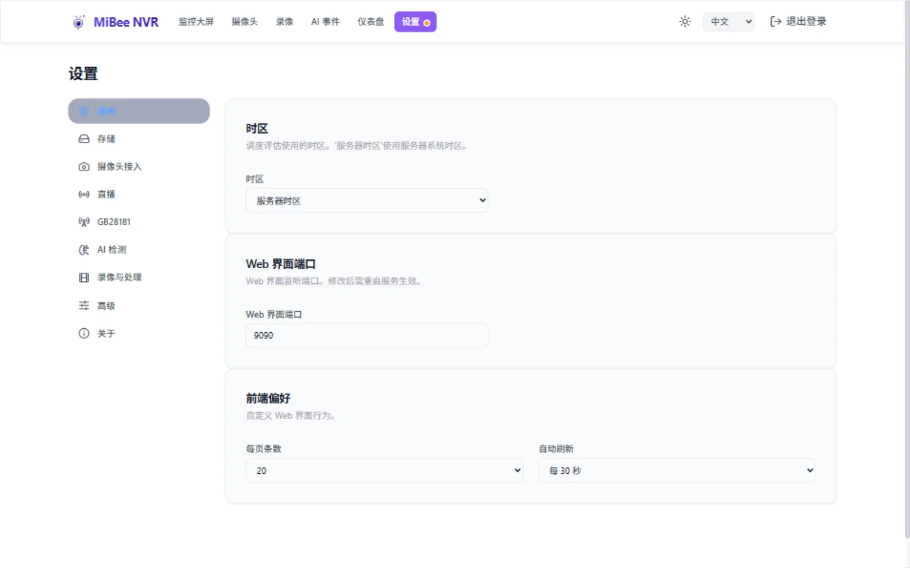

# MiBee NVR 配置参考文档

MiBee NVR 使用 YAML 格式的配置文件来控制所有功能模块。以下是所有可用选项的完整参考，包含默认值和使用示例。



## 配置文件结构

```yaml
server:
  listen: ":9090"
storage:
  root_dir: "/var/lib/mibee-nvr"
  segment_duration: "30s"
auth:
  username: "admin"
  password_hash: ""
  password: ""
  local_bypass: false          # 运行在 NVR 宿主机本机的浏览器（localhost）免登录（默认关）
cameras:
  - id: "cam1"
    name: "摄像头名称"
    protocol: "rtsp"
    encoding: "h264"
    url: "rtsp://..."
    enabled: true
    onvif_endpoint: ""           # ONVIF 特定
    profile_token: ""            # ONVIF 特定
    stream_encoding: ""          # ONVIF 自动检测 (H264/H265)
    sub_stream_url: "rtsp://..."  # 实时预览子流
    snapshot_url: "http://..."    # JPEG 快照缩略图
    sample_interval: 1            # MJPEG 帧采样间隔
    hls_max_fps: 0               # HLS 帧率限制
    vendor: ""                   # 小米传输供应商
    merge:                       # 每个摄像头合并配置覆盖
      enabled: false
      check_interval: "1h"
      window_size: "1h"
      batch_limit: 150
      min_segment_age: "5m"
      min_segments_to_merge: 2
cleanup:
  retention_days: 30
  check_interval: "1h"
  disk_threshold_percent: 95
merge:
  enabled: false
  check_interval: "1h"
  window_size: "1h"
  batch_limit: 200
  min_segment_age: "10m"
  min_segments_to_merge: 3
  rolling_enabled: true              # 事件驱动滚动合并（默认开），消除 30s 碎片段
  rolling_debounce: "5s"
  rolling_window: "1h"
  rolling_min_duration: "5m"
  rolling_bucket_retain: 2           # 每相机保留的桶数（按参数集分键，#764）；1 = 旧单桶行为
  rolling_bucket_idle_ttl: "10m"     # 桶空闲超过该时长即 finalize；"0" 关闭空闲淘汰
  rolling_backfill_max_segments: 500 # 启动回填上限（防 RPi IO 风暴）
  rolling_backfill_max_age: "72h"    # 只回填最近 N 小时的段
ftp:
  enabled: true
  port: 2121
  passive_port_range: "2122-2140"
mqtt:
  enabled: false
  broker: "tcp://localhost:1883"
  topic: "mibee"
  client_id: "mibee-nvr"
  username: ""
  password: ""
webdav:
  enabled: true
  path_prefix: "/dav"
  read_write: false
hls:
  write_buffer_size: 100         # 每个流的异步帧缓冲区
  segment_max_size_mb: 10        # HLS 片段最大大小 (MB)
  segment_count: 7               # 每个流的片段数 (范围: 3-10)
  max_streams: 4                 # 最大并发流数 (范围: 1-20，RPi 限制: 4)
  low_latency: true              # 低延迟 HLS (LL-HLS)，默认开启；false = 经典分段播放列表
  part_min_duration: "200ms"     # LL-HLS 分片时长 (范围: 100ms-1s)
streaming:
  webrtc:
    enabled: true                  # 启用 WebRTC WHEP 直播
    max_viewers: 2                # 最大并发 WebRTC 观众数 (范围: 1-10)
  flv:
    enabled: true                  # 启用 HTTP-FLV 直播
    max_viewers: 10               # 最大并发 FLV 观众数 (范围: 1-50)
websocket:
  max_viewers: 10               # 最大并发 WebSocket 观众数
health:
  enabled: false                 # 启用摄像头健康监控
remote_log:
  enabled: false                 # 启用远程日志
  endpoint: ""                    # 日志投递的 HTTP 端点 URL
  format: "jsonline"              # 日志格式: jsonline 或 loki
ai:
  enabled: false                 # 启用 AI 检测
  model_path: ""                  # ONNX 模型路径
  confidence_threshold: 0.5      # AI 检测置信度阈值 (范围: 0-1)
  inference_timeout_ms: 1000     # AI 推理超时 (毫秒)
  frame_skip_rate: 2             # 帧跳过率 (每 N 帧处理一帧)
rtmp:
  enabled: false                 # 启用 RTMP 服务器
  port: 1935                    # RTMP 监听端口
srt:
  enabled: false                 # 启用 SRT 监听器
  port: 9000                    # SRT 监听端口
metrics_auth:
  username: ""                   # Metrics 端点用户名
  password: ""                   # Metrics 端点密码
xiaomi:
  user_id: ""                    # 小米账户用户 ID (来自认证响应)
  token: ""                      #小米 passToken API 访问令牌
  region: "cn"                   # 区域代码: cn, sg, de 等
observability:
  log_level: "info"              # 日志级别: debug, info, warn, error
  log_format: "text"             # 日志格式: json 或 text
  stdlog_throttle: "10s"         # 三方库 stdlib 日志限流间隔（"off" 关闭）
  enable_pprof: false            # 启用 pprof 调试端点
version: "1.0"
```

## 服务器配置

### `server.listen`
- **类型**: string
- **默认**: `":9090"`
- **描述**: Web 服务器监听地址和端口
- **示例**: `":8080"` 或 `"192.168.1.100:9090"`
- **环境变量覆盖**：`NVR_LISTEN_PORT` 环境变量在启动时覆盖端口部分（如 `NVR_LISTEN_PORT=8080`）。适用于无法编辑配置文件的 NAS host-networking 部署。也可通过 `install.sh --port <端口>` 或 Web UI 设置页设置。

### `server.device_id` / `server.device_name`
- **类型**： string
- **默认**： `device_id` 首次启动自动生成（UUIDv4，持久化）；`device_name` 默认取主机名
- **说明**： 通过 `GET /api/health` 暴露的稳定局域网身份，客户端（如手机 App）可锚定 ID 而非易变的 IP。均可选；显式设置 `device_name` 会覆盖主机名。
- **示例**： `device_name: "garage-nvr"`

### `server.discovery.mdns.enabled` / `server.discovery.udp.*`
- **类型**： bool /（bool, int）
- **默认**： 均为 `true`；UDP 端口 `49090`
- **说明**： 局域网自通告。mDNS/DNS-SD 注册 `_mibee-nvr._tcp` 服务；UDP 应答器用 JSON 身份载荷回应 `MIBEE-NVR-DISCv1?` 广播探测（覆盖组播受限的 Wi-Fi）。绑定失败只记日志，绝不阻塞启动。

### `server.rtsp.enabled` / `server.rtsp.port`
- **类型**： bool / int
- **默认**： `true` / `8554`
- **说明**： 内置 RTSP 输出服务端——每路相机一个固定取流地址 `rtsp://<NVR-IP>:8554/<camera_id>`，第三方平台（如群晖 Surveillance Station）可直接填为摄像头源。H.264/H.265 原生输出（无转码、仅视频；MJPEG/JPEG 相机不供流）。凭据可选（`username`/`password`，空 = 局域网开放；同时设置后启用 Basic/Digest 鉴权，地址写 `rtsp://user:pass@<NVR-IP>:8554/<camera_id>`）。Docker 部署需发布端口（`-p 8554:8554`）；端口被占仅记录错误，不影响主服务。接入 Home Assistant 见 [接入 Home Assistant](./home-assistant.md)。
- **示例**： 见[子码流 · RTSP 输出](sub-stream.md#rtsp-输出第三方平台取流)

### `server.substream.idle_timeout_s` / `server.substream.ready_timeout_s`
- **类型**： int / int
- **默认**： `30` / `8`
- **说明**： 子码流按需拉取参数——`idle_timeout_s` 为无消费者后保持拉取多久再回收；`ready_timeout_s` 为 `quality=sub` 请求等待首帧就绪的超时。详见[子码流](sub-stream.md)。

### `server.unix_socket`
- **类型**: string
- **默认**: 空（不监听 Unix socket）
- **描述**: fnOS 网关部署形态的 Unix domain socket 监听路径。网关进程先自行验证用户会话，再把已认证请求转发到该 socket（携带受信任的 `X-Trim-*` 用户头）；gateway-auth 中间件只挂在该监听器上，TCP 端口上这些头一律忽略。可通过环境变量 `NVR_UNIX_SOCKET` 覆盖
- **示例**: `"/run/mibee-nvr/nvr.sock"`

### `server.base_path`
- **类型**: string
- **默认**: 空（服务在 `/` 提供）
- **描述**: 反向代理/网关子路径部署的 URL 前缀（如 fnOS 应用中心的 `/app/mibee-nvr`）。携带该前缀的请求路径先剥离再路由；前缀同时注入 `index.html` 供 SPA 构建绝对 URL（静态资源、API、流端点）。可通过环境变量 `NVR_BASE_PATH` 覆盖
- **示例**: `"/app/mibee-nvr"`

## 存储配置

### `storage.root_dir`
- **类型**: string
- **默认**: `/var/lib/mibee-nvr`（二进制）或 `/data`（Docker）
- **描述**: 存储录像、数据库和临时文件的根目录。所有摄像头录像存储在 `{root_dir}/{camera_id}/` 下。
- **Docker**: 在 Docker 中运行时，通过 `NVR_DATA_DIR` 环境变量设置。卷挂载和 `NVR_DATA_DIR` 必须一致。
- **二进制**: 可通过 `mibee-nvr init --data-dir` 参数设置，或直接在 YAML 配置中指定。
- **示例**: `/var/lib/mibee-nvr`、`/mnt/external/nvr`、`/data`

### `storage.segment_duration`
- **类型**: string
- **默认**: `"30s"`
- **描述**: 视频片段时长（内存密集型）
- **重要**: 每个片段在完成前会将所有视频数据保存在 RAM 中
- **内存使用**:
  - 30s 片段: ~15-20MB 每片段
  - 60s 片段: ~30-40MB 每片段
  - 120s 片段: ~60-80MB 每片段
- **平台感知上限（启动时自动应用）**：为保证 MP4 muxer 的 RAM 使用安全，配置值会根据可用内存被钳制：
  - **可用 RAM ≤2 GB**（例如树莓派 3B）：上限为 **30s**
  - **可用 RAM >2 GB**（例如 Banana Pi M5、x86）：最高 **2m**（120s），可将滚动合并需处理的分片数减半
  - 超过平台上限的值会被**静默钳制**并在日志中给出告警（不会导致启动失败）。在非 Linux 主机或无法读取 `/proc/meminfo` 时，应用保守的 30s 上限。
- **RPi 限制**: 树莓派 3B 上最大 30 秒
- **示例**: `"30s"`, `"1m"`, `"5m"`

### `storage.durability`
- **类型**: string
- **默认**: `""`（= `strict`）
- **取值**:
  - `strict`（默认）—— 每个原始段 finalize 在 temp→final rename 前显式 `fsync`。最强崩溃保证：断电后 NVR 已确认落盘的数据都在介质上。
  - `relaxed` —— 原始段跳过主动 `fsync`，交给文件系统提交间隔兜底（ext4 通常 5s）。temp→final **rename 保持原子性**：崩溃后要么是崩溃前的完整字节、要么没有 final 文件——绝不会出现截断/半成品段。代价：断电可能丢最后几秒（~最多 1 分钟）的原始滚动录像。
- **两档恒为 strict**: 合并产物、timelapse 产物、数据库（WAL+NORMAL）、配置写入——长期资产保留 fsync。
- **适合谁**: 闪存板（SD/eMMC，每段 fsync 是延迟尖峰 + 写放大来源——13 路 × 30s 段 ≈ 每分钟 26 次 fsync）；连续录像的 HDD 阵列。
- **示例**: 在 `storage:` 节下写 `durability: "relaxed"`。
### `storage.prealloc_enabled`
- **类型**: boolean
- **默认**: `true`（不设置即视为开启）
- **描述**: 录像段整段预分配（fallocate）——用上一段的实际大小估算本段大小并一次性预留连续磁盘区域，免去逐次追加的 inode 元数据事务，减少 SD/eMMC 写放大、提升合并/回放读取局部性。预分配只是提示不是上限，实际写入超出会照常增长；不支持 fallocate 的文件系统自动降级为普通追加写。设为 `false` 恢复纯追加写（重启生效）
- **示例**: `true`, `false`

### `storage.prealloc_headroom_percent`
- **类型**: int
- **默认**: `10`
- **描述**: 预分配相对上一段大小的余量百分比（吸收码率漂移，避免段内再次增长）；范围 0–400
- **示例**: `10`, `25`

### `storage.prealloc_min_bytes`
- **类型**: int
- **默认**: `4194304`（4MiB）
- **描述**: 预分配下限——上一段小于该值时跳过预分配（小段的 extent 抖动不值得折腾）；不得大于 `prealloc_max_bytes`
- **示例**: `4194304`

### `storage.prealloc_max_bytes`
- **类型**: int
- **默认**: `536870912`（512MiB）
- **描述**: 单段预分配上限，防止病态大段把后续段的预留空间也撑爆
- **示例**: `536870912`

#### 轮转节奏是 I/O 开关

> 告警阈值本身可配置：`storage.segment_duration_warn_below`
> （默认 `"60s"`，设 `"0s"` 关闭告警）。

每次轮转都有一笔固定元数据成本——段创建、temp→final rename、fsync、每段 2 行
DB 记录。全局时长越短，**所有**相机付费越频繁：30s × 13 路≈每分钟 26 次轮转；
120s ≈ 6.5 次。连续录像建议全局 **60–120s**；单相机确需短轮转（如高时间分辨率
timelapse 采样）时，用 **per-camera 覆盖**而不是缩短全局：

```yaml
storage:
  segment_duration: "120s"
cameras:
  - id: timelapse-cam
    segment_duration: "15s"   # 仅该相机生效（#758）
```

当全局值低于 60s 且存在未覆盖的 continuous 模式相机时，`config.Validate()`
会输出警告——`mibee-nvr validate-config` 同样会呈现。

> 存储与内存的系统性调优（fsync 持久化分级、预分配、GOMEMLIMIT、后台 I/O 预算）见[性能调优](performance.md)。

### `storage.periodic_temp_grace_s`
- **类型**: integer
- **可选**: 是
- **默认**: `86400`（24h）
- **描述**: periodic 合并临时目录（`<root>/periodic-merge/tmp` 下的 `periodic_extract_*` / `periodic_go_merge_*`）的启动清扫宽限期。崩溃或 Ctrl-C 中断的合并会遗留这些目录（正常路径由 defer 清理）；NVR 启动/每轮合并开始时回收超过宽限期的遗留。**调小有删活数据的风险**——慢速 ARM + USB HDD 上 natural-day 窗口合并可能跑数小时，宽限期必须大于最长合并时长；调大则泄漏滞留更久。全局键（tmp 目录全相机共享）。
- **示例**: `86400`, `172800`

### `storage.db_path`
- **类型**: string
- **可选**: 是
- **默认**: 数据目录下的 `mibee-nvr.db`
- **描述**: SQLite 数据库位置。**与录像根目录解耦**——切换 `root_dir` / 迁移录像不会移动数据库（裸机部署首次启动自动固定，防换根后误建空库）。Docker 部署固定在 `NVR_DATA_DIR`。
- **一般无需配置**。

### `storage.camera_roots`
- **类型**: map（cameraID → 路径）
- **可选**: 是
- **描述**: 按相机存储覆盖——映射内的相机录像写入指定目录，其余写默认根。**对新分段即时热生效**；历史文件用后台迁移器搬运。运行时也可经 API / Web UI 操作（见[存储管理](storage-management.md)）。
- **示例**: `backyard: "/mnt/bigdisk/recordings"`

### `storage.migration_rate_mb` / `storage.migration_window`
- **类型**: int / string
- **默认**: `15` / 空（全天）
- **描述**: 后台录像迁移器的复制限速（MB/s，不与录制抢 IO）与迁移时间窗（本地时间，如 `"22:00-06:00"`；空 = 全天限速迁移）。

## 内存配置

GOMEMLIMIT 自动启发式（#756）——按部署环境自动推导堆上限。所有值为运维可调，接线代码只读具体配置值。

### `memory.auto_physical_percent`
- **类型**: integer
- **默认**: `45`
- **描述**: 裸机部署时按物理内存百分比推导堆上限的份额（%）

### `memory.auto_cap_bytes`
- **类型**: integer
- **默认**: `1073741824`（1GiB）
- **描述**: 物理内存推导路径在大内存主机上的封顶值（字节）

### `memory.auto_cgroup_percent`
- **类型**: integer
- **默认**: `80`
- **描述**: 运行在 cgroup 内存上限之下时（容器部署：fnOS/Docker），从 cgroup 上限取的份额（%）

## 身份验证配置

### `auth.username`
- **类型**: string
- **必需**: 是（Web UI 和 FTP 需要）
- **描述**: 身份验证用户名
- **示例**: `"admin"`

### `auth.password_hash`
- **类型**: string
- **必需**: 是（Web UI 和 FTP 需要）
- **描述**: bcrypt 哈希密码。使用 `mibee-nvr hash-password <password>` 生成
- **优先级**: 如果同时设置了 `password` 和 `password_hash`，`password_hash` 优先
- **注意**: 如果只提供了 `auth.password`（明文），服务器会在首次启动时自动生成哈希值并写回到配置文件的 `password_hash`，然后清除 `password` 字段
- **示例**: `$2a$10$N9qo8uLOickgx2ZMRZoMy...`

### `auth.password`
- **类型**: string
- **可选**: 是
- **描述**: 明文密码，方便初始设置。首次运行时，服务器会自动哈希此值并写入到 `password_hash`，然后清除 `password` 字段
- **优先级**: 仅在 `password_hash` 为空时使用
- **示例**: `"admin123"`

### `auth.local_bypass`
- **类型**: boolean
- **默认**: `false`
- **描述**: 允许运行在 NVR 宿主机本机的浏览器（loopback 连接 `127.0.0.1` / `::1`，且请求不带任何代理转发头）跳过登录页直接访问 Web UI。前端通过 `/api/health` 的 `local_access` 字段感知并跳过登录页。
- **重要安全警告**: 仅**裸机（systemd/原生二进制）部署**适用。**反向代理（Caddy/nginx）与 Docker 端口映射部署严禁开启**——这两种拓扑下所有请求都会从 `127.0.0.1` 到达服务器，开启本开关会让**所有远程客户端绕过认证**。
- **生效条件**（三者缺一不可）: `local_bypass: true`、请求来源为 loopback（RemoteAddr 127.0.0.1/::1）、**Host 头为 `localhost`/`127.0.0.1`/`[::1]`**（去掉端口后）、无 `X-Forwarded-For`/`X-Real-IP`/`Forwarded` 代理头。用宿主机局域网 IP 或主机名访问**不会** bypass（有意保守，兼防恶意网页与 DNS rebinding）。
- **示例**: `local_bypass: true`

### `auth.rate_limit.enabled` / `auth.rate_limit.max_failures` / `auth.rate_limit.window_minutes`
- **类型**: boolean / integer / integer
- **默认**: `false` / `20` / `1`
- **描述**: 登录失败限流。启用后在 `window_minutes` 分钟窗口内累计 `max_failures` 次认证失败即触发限流，防止在线爆破。默认关闭
- **示例**: `true`, `20`, `1`

## 摄像头配置

### 摄像头结构
每个摄像头配置需要这些基本字段：

```yaml
cameras:
  - id: "cam1"
    name: "摄像头名称"
    protocol: "rtsp"
    encoding: "h264"
    url: "摄像头地址"
    enabled: true
```

### `cameras[].id`
- **类型**: string
- **必需**: 是
- **描述**: 摄像头的唯一标识符（如果未提供则自动生成）
- **格式**: 字母数字，推荐用 kebab-case（例如 "front-door"）
- **示例**: `"front-door"`, `"cam-01"`

### `cameras[].name`
- **类型**: string
- **必需**: 是
- **描述**: 人类可读的摄像头名称
- **示例**: `"前门摄像头"`, `"后院"`

### `cameras[].protocol`
- **类型**: string
- **必需**: 是
- **描述**: 摄像头传输协议
- **选项**: `"rtsp"`, `"http"`, `"onvif"`, `"xiaomi"`, `"timelapse"`
- **旧格式**: 不支持——组合格式字符串如 `"rtsp_h264"`, `"rtsp_h265"`, `"rtsp_mjpeg"`, `"http_jpeg"` 自 0.10.0 起校验报错拒绝
- **注意**: 请改用独立的 `protocol` + `encoding` 字段（见下方 `cameras[].encoding`）
- **兼容性**: 仅支持独立的 `protocol` + `encoding` 格式

### `cameras[].encoding`
- **类型**: string
- **可选**: 是（从旧协议自动检测或根据协议设置默认值）
- **描述**: 视频编码格式
- **选项**: `"h264"`, `"h265"`, `"mjpeg"`, `"jpeg"`
- **有效组合**:
  - `protocol: "rtsp"` → `encoding: "h264"`, `"h265"`, 或 `"mjpeg"`
  - `protocol: "http"` → `encoding: "jpeg"`
  - `protocol: "onvif"` → `encoding: "h264"` 或 `"h265"`（如果未指定则自动检测）
  - `protocol: "xiaomi"` → `encoding: "h264"` 或 `"h265"`（自动检测）
  - `protocol: "timelapse"` → `encoding: "h264"` 或 `"h265"`（与录像机编码匹配）

### `cameras[].url`
- **类型**: string
- **必需**: 是（ONVIF 和 Xiaomi 摄像头除外）
- **描述**: 摄像头地址或流端点
- **示例**:
  - RTSP: `"rtsp://192.168.1.100:554/stream"`
  - HTTP: `"http://192.168.1.101/capture"`
  - ONVIF: `"http://192.168.1.102:80/onvif/device_service"`（或使用 `onvif_endpoint`）
- **验证**: 必须有有效的协议（http/rtsp）和主机

### `cameras[].username`
- **类型**: string
- **可选**: 是
- **描述**: 摄像头身份验证用户名
- **示例**: `"admin"`

### `cameras[].password`
- **类型**: string
- **可选**: 是
- **描述**: 摄像头身份验证密码
- **示例**: `"摄像头密码"`

### `cameras[].enabled`
- **类型**: boolean
- **默认**: `true`
- **描述**: 是否启用摄像头录制
- **示例**: `true` 或 `false`

### `cameras[].onvif_endpoint`
- **类型**: string
- **可选**: 是（ONVIF 摄像头如果未提供 URL 则必需）
- **描述**: ONVIF 设备服务端点地址
- **示例**: `"http://192.168.1.100:80/onvif/device_service"`
- **注意**: 如果为 ONVIF 摄像头设置了 URL，会自动复制到 onvif_endpoint

### `cameras[].profile_token`
- **类型**: string
- **可选**: 是
- **描述**: ONVIF 媒体配置文件令牌，用于特定流选择
- **示例**: `"profile_1"`
- **注意**: 可选，如果未指定则使用默认配置文件

### `cameras[].stream_encoding`
- **类型**: string
- **可选**: 是
- **描述**: ONVIF 摄像头的流编码 (H264 或 H265)
- **选项**: `"H264"`, `"H265"`
- **注意**: 空 = 从 ONVIF 设备功能自动检测

### `cameras[].sub_stream_url`
- **类型**: string
- **可选**: 是
- **描述**: 相机低分辨率子码流的手动 RTSP 地址——显式 `quality=sub` 观看（宫格「流畅」、直播画质切换、级联子码流上报）时按需拉取，见[子码流](sub-stream.md)。ONVIF 相机通常无需手填——连接后自动发现子流 profile（`sub_profile_token`）
- **注意**: 子流必须使用与主流相同的编解码器（H.264/H.265）
- **示例**: `"rtsp://192.168.1.100:554/stream2"`

### `cameras[].sub_profile_token`
- **类型**: string
- **可选**: 是
- **描述**: ONVIF 子码流 Profile Token。**留空 = 自动发现**（取主 profile 之外分辨率次高者，发现后回填一次；清空保存可重新发现）。手动填写可覆盖自动发现结果
- **示例**: `"SubStreamToken"`, `"Profile2"`

### `cameras[].snapshot_url`
- **类型**: string
- **可选**: 是
- **描述**: 返回 JPEG 快照图像的 HTTP 地址。配置后，仪表板将显示快照缩略图而不是实时 HLS 流，显著减少带宽
- **行为**: 快照缓存 10 秒；摄像头暂时无法访问时提供缓存的内容
- **示例**: `"http://192.168.1.100/snapshot"`, `"http://192.168.1.100/cgi-bin/snapshot.cgi"`

### `cameras[].sample_interval`
- **类型**: integer
- **可选**: 是
- **默认**: 1（仅限 MJPEG 摄像头）
- **描述**: MJPEG 帧采样间隔（秒）。较高的值可减少 CPU 使用率但降低帧率
- **示例**: `1`, `2`, `5`

### `cameras[].mjpeg_form`
- **类型**: string
- **可选**: 是
- **默认**: `"avi"`（#761）
- **描述**: MJPEG/JPEG 相机（rtsp+mjpeg、http_jpeg、ONVIF-JPEG）的录像段形态。`"avi"`——每段一个 AVI 单文件容器（默认；消除每帧一文件的元数据 churn，删除从整目录递归退化为单次 unlink，深扫/保留期开销大幅下降）；`"dir"`——旧的每帧一个 JPEG 文件目录形态（显式退路）。开启音频的 MJPEG 相机始终录制 AVI，与本项无关。变更需重启 NVR 生效。旧键 `http_jpeg_avi` 已废弃——其值不再被读取（AVI 即默认；需要目录形态请设 `mjpeg_form: "dir"`）。
- **示例**: `"avi"`, `"dir"`
- **存量段**: 目录形历史段可继续回放/合并/清理，无需迁移即可混用；如需收敛为单文件形态，运行 `mibee-nvr repair mjpeg-containerize`（默认 dry-run，`--execute` 生效，`--camera`/`--limit` 过滤，`--keep-old` 保留源目录；每段先验证容器帧数再翻转 DB 行）。

### `cameras[].dark_frame_filter_enabled` / `cameras[].dark_frame_threshold`
- **类型**: boolean / integer
- **可选**: 是
- **默认**: `false` / `15`
- **描述**: 暗帧过滤（仅 MJPEG/AVI 相机）——启用后每段收尾时做亮度检查，过暗的段（夜间无红外能力）标记 `merge_status='dark'`，不参与合并并提前清理。`dark_frame_threshold` 为亮度判定阈值（0–255）
- **示例**: `true`, `15`

### `cameras[].hls_max_fps`
- **类型**: integer
- **可选**: 是
- **默认**: 0（无限制）
- **描述**: HLS 流媒体的最大帧率。0 = 无限制
- **示例**: `30`, `15`, `25`

### `cameras[].vendor`
- **类型**: string
- **可选**: 是
- **描述**: 小米摄像头的传输供应商
- **选项**: `"cs2"`（默认）
- **示例**: `"cs2"`

### `cameras[].audio_enabled`

- **类型**: boolean
- **默认**: `false`
- **描述**: 启用此摄像头的音频录制。启用后，录制器会从 RTSP/ONVIF/小米摄像头流中捕获音频并将其混入 MP4 录像。音频也可通过 WebSocket 音频端点进行实时预览播放。
- **支持格式**: AAC（RTSP 摄像头）、G.711 μ-law/A-law（ONVIF/小米摄像头）、Opus（小米摄像头）
- **注意**: MJPEG 和 HTTP-JPEG 摄像头不支持
- **示例**: `true`, `false`

### `cameras[].audio_in_recordings`

- **类型**: boolean
- **默认**: `false`
- **描述**: 录像文件是否保留相机真实音轨（合并产物的事件段）。默认不保留——录像为纯视频；直播试听与[音频触发](adaptive-recording.md#音频触发)不受此开关影响
- **示例**: `true`, `false`

### `cameras[].recording_mode`

- **类型**: string
- **默认**: `"continuous"`
- **取值**: `"continuous"`（全帧率连续录制）/ `"adaptive"`（动静感知自适应录制）
- **描述**: 写入密度策略。`adaptive` 模式下画面安静时只写每 `adaptive.timelapse_interval` 一个关键帧，活动 / 音频 / 外部触发立即恢复全帧率（详见[自适应录制](adaptive-recording.md)）。仅 H.264/H.265 相机（MJPEG 无压缩域差分信号）
- **示例**: `"adaptive"`

### `cameras[].recording_tier`
- **类型**: string
- **可选**: 是
- **默认**: 空（单层录制）
- **取值**: 空 / `"single"` / `"tiered"`
- **描述**: 分层录制（tierrec）。`"tiered"` = 子码流录成低清连续 layer=1 段 + 主码流事件驱动，推荐搭配 adaptive + `video_exit: false`（+ pixgate）让主码流纯事件化，适合近空场景。需要子码流能力协议（rtsp/onvif/gb28181），校验不符拒绝保存

### `cameras[].adaptive`

- **类型**: object
- **可选**: 是（仅 `recording_mode: "adaptive"` 时有意义）
- **描述**: 自适应录制调参（全部可选，以下为默认值；详见[自适应录制](adaptive-recording.md#参数调优)）
- **字段**:
  - `calm_threshold` (string, 默认 `"60s"`, 范围 10s–30m) — 平静判定时长
  - `timelapse_interval` (string, 默认 `"30s"`, 范围 5s–10m) — 稀疏期关键帧间隔
  - `spike_factor` (float, 默认 `5.0`, 范围 1.5–20) — 活动灵敏度阈值
  - `gop_buffer_bytes` (int, 默认 `33554432`, 范围 1–64MB) — GOP 预缓冲上限
  - `noise_floor_bytes` (float, 默认 `0` 禁用, 范围 0–8MB) — 帧尺寸绝对噪声地板（字节）。夜间模式/码率崩塌等编码器噪声使相对尖峰指标误报时启用
  - `auto_noise_floor` (boolean, 默认 `true`) — 从稀疏期帧尺寸自标定噪声地板（已知静止的稀疏帧 p99×1.25，封顶滚动中位数 4 倍）
  - `video_exit` (boolean, 默认 `true`) — 是否保留视频尖峰退出稀疏模式。关闭后只有音频事件或外部语义触发（`POST /api/cameras/{id}/adaptive/trigger`）能恢复全速率
  - `ambient_audio` (boolean, 默认 `false`) — 稀疏期连续录制环境声（合并时合成氛围层，仅 G.711）
  - `timelapse_frame_ms` (int, 取值 100/300/500, 默认 100) — 合并产物的延时帧距
  - `ambient_archive` (boolean, 默认 `false`) — 原始环境声另存 `<segment>.g711` 附属文件

### `cameras[].audio_trigger`

- **类型**: object
- **可选**: 是（仅 `recording_mode: "adaptive"` 的 G.711 音频相机生效）
- **描述**: 响度触发录像——异常声音让相机退出稀疏模式并回填预触发音频（详见[自适应录制 · 音频触发](adaptive-recording.md#音频触发)）
- **字段**:
  - `enabled` (boolean, required) — 启用响度输入
  - `min_dbfs` (float, 默认 `-45`, 范围 -90–0) — 1 秒窗口响度阈值
  - `pre_capture_s` (int, 默认 `3`, 范围 0–30) — 预录音频秒数

### `cameras[].pixgate`
- **类型**: object
- **可选**: 是
- **描述**: 像素活动门控（#699）——按相机独立采样分析画面活动，确认的活动作为 adaptive 录制的全速率退出触发输入（与视频尖峰、音频触发并列）。遥测指标见[监控指标](metrics.md)
- **字段**:
  - `enabled` (boolean, 默认 `false`) — 启用该相机的门控采样
  - `sample_fps` (float, 默认 `1`, 范围 0.2–2) — 采样率
  - `min_area_pct` (float, 默认 `1.5`, 范围 0.1–50) — 判定为活动的最大 blob 面积占分析网格的百分比
  - `persist` (int, 默认 `2`, 范围 1–10) — 连续活跃样本达到该数量才确认活动
  - `hold` (string, 默认 `"30s"`, 范围 1s–10m) — 每次确认活动后保持全速率的时长
  - `ghost_secs` (float, 默认 `300`, 范围 0–3600) — 静止 blob（开灯、停车、镜头水滴）持续触发多久后被背景模型吸收；运动物体永不吸收
  - `masks` (array) — 排除多边形（归一化 [0,1] 坐标）——天空、水面、街道等永久微动区域永不判为活动

### `cameras[].recording_schedule`

- **类型**: object
- **可选**: 是
- **描述**: 录制时间窗（默认 24/7）。时间窗外不落盘（直播不受影响）
- **字段**:
  - `time_ranges` (array) — `{start: "09:00", end: "18:00"}` 列表，重叠自动合并
  - `days_of_week` (array of int) — 0=周日 … 6=周六；空 = 每天

### `cameras[].cascade_enabled`

- **类型**: boolean
- **默认**: `true`（nil 同 true）
- **描述**: GB28181 下级级联的目录收敛开关——`false` 时该相机从上级平台聚合目录中隐藏，对其通道的 INVITE 返回 404。通道编码分配保留，重新开启即恢复原编码（上级绑定不漂移）
- **示例**: `false`

### `cameras[].cascade_sub_stream`

- **类型**: boolean
- **默认**: `false`
- **描述**: 级联上报改走相机**子码流**（#512/#513）——低分辨率档让上行带宽可控。相机无子码流或拉取失败时 INVITE 自动回退主流；无子码流的相机不受影响
- **示例**: `true`

### `cameras[].did`

- **类型**: string
- **可选**: 是（小米摄像头必需）
- **描述**: 来自云服务的小米设备 ID
- **示例**: `"xiaomi_device_id_123"`

### `cameras[].merge`
- **类型**: object
- **可选**: 是
- **描述**: 每个摄像头合并配置覆盖
- **注意**: 只有非零字段会覆盖全局合并配置
- **示例**: 参见 [合并配置](#合并配置)

### `cameras[].timelapse`
- **类型**: object
- **可选**: 是
- **描述**: 每个摄像头延时摄影配置覆盖
- **字段**:
  - `enabled` (boolean) - 启用延时摄影
  - `interval` (string, 默认: "30s", 最小: "1s") - 快照间隔
  - `output_fps` (int, 默认: 30, 范围: 1-60) - 输出帧率
  - `video_codec` (string, 默认: "h264") - 视频编码 (h264/h265)
  - `delete_original` (boolean, 默认: false) - 延时摄影后删除原始片段
  - `merge_enabled` (boolean) - 启用合并 (nil=自动检测)
  - `merge_mode` (string, 默认: "auto") - 合并模式: auto, mp4, jpeg
  - `daily_merge` (boolean, 默认: true) - 每日合并
  - `merge_output_fps` (int, 默认: 30, 范围: 1-60) - 合并输出帧率
- **示例**: 参见 [延时摄影配置](#延时摄影配置)

### `cameras[].health_overrides`
- **类型**: object
- **可选**: 是
- **描述**: 每个摄像头健康监控阈值覆盖。设置后，非零值优先于全局健康配置
- **字段**:
  - `max_idr_interval` (string) - 最大 IDR 帧间隔
  - `bitrate_change_threshold` (float, 范围: 0-1) - 码率变化阈值
  - `min_fps` (int) - 最小帧率
  - `offline_threshold` (string) - 离线判定阈值
  - `freeze_timeout` (string) - 画面冻结超时

### `cameras[].frame_watchdog_timeout`
- **类型**: string
- **可选**: 是
- **默认**: `"30s"`
- **描述**: 每个摄像头的帧超时阈值。如果在此时间内未收到新帧，将触发看门狗重启
- **示例**: `"30s"`, `"60s"`, `"2m"`

### `cameras[].subnet_hints`
- **类型**: array of string
- **可选**: 是
- **描述**: 候选 CIDR 列表——相机漫游后可能出现的网段。IP 自愈重发现扫描除最后已知地址和 NVR 本机网段外，还会探测这些网段。空 = 只扫最后已知地址 + 本地网段
- **示例**: `["192.0.2.0/24", "198.51.100.0/24"]`

### `cameras[].ring_buf_cap`
- **类型**: int
- **可选**: 是
- **默认**: `0`（使用内置默认 300）
- **描述**: 覆盖录制器帧环形缓冲（frameCh）容量（#521）。写线程停顿（分段收尾 fsync、合并 IO、锁竞争）时缓冲吸收积压；缓冲满则丢帧（`nvr_recorder_ring_buffer_drops_total` 指标 + 流量页录像分支的溢出计数）。偶发丢帧的相机可调大此值换取停顿容忍（每格约 1KB 内存）。仅 H.264/H.265 录制器生效。范围 0–10000。
- **示例**: `600`, `1000`

### `cameras[].vision_targets`
- **类型**: array of string
- **可选**: 是
- **描述**: 该相机的录像推送到哪些 Vision 实例（多实例路由，见 `vision.instances`）。空 = 全部启用实例（单实例默认行为）。名字必须存在于 `vision.instances`，未知名字 API 校验返回 400
- **示例**: `["jetson-yolo", "coral-tpu"]`

### `cameras[].push_targets`
- **类型**: array of objects
- **可选**: 是（任何摄像头协议均可）
- **描述**: 推流转发目标 — 将此摄像头的直播流转发到远程目的地（另一个 NVR 的推流接收、直播平台、备份）。默认使用内置 Go 中继，可选 FFmpeg。每个目标是一个独立连接。参见[推流转发指南](./relay-guide.md)。
- **每个目标的字段**:
  - `id` (string, required) — 摄像头内稳定标识符
  - `name` (string, optional) — 显示名称
  - `protocol` (string, required) — `"rtmp"` 或 `"rtsp"`
  - `url` (string, required) — 目标 URL（`rtmp://host:1935/app/key` 或 `rtsp://host:8554/path`）
  - `enabled` (boolean, required) — 目标是否启用
  - `platform` (string, optional) — 平台预设：`"bilibili"`、`"douyin"`、`"youtube"`、`"kuaishou"`、`"generic"`，或留空表示自定义
  - `transcode_policy` (string, optional, 默认: `"off"`) — `"auto"`（探测硬件，回退软件转码）、`"force_sw"`（始终使用 libx264）、`"off"`（拒绝 H.265 源）
  - `video_preset_override` (object, optional) — 覆盖预设参数：`{ resolution, framerate, video_bitrate_kbps, gop_seconds, profile, bframes }`
- **注意**: H.264 源零拷贝直接转发。H.265 源在设置 `transcode_policy` 时会实时转码为 H.264（需要 FFmpeg）。热监控保护 ARM 单板计算机在转码期间免受过热影响。参见[推流转发指南](./relay-guide.md)了解详情。

## API Keys 配置

### `api_keys`
- **类型**: array of objects
- **可选**: 是
- **描述**: MiBeeVision API 密钥，用于外部 AI 处理集成。密钥使用 `mbv_` 前缀，通过 Bearer token 进行身份验证（在 BasicAuth 之前检查）。参见[身份验证](./api/authentication.md)了解详情。
- **每个密钥的字段**:
  - `name` (string, required) — 密钥的显示名称
  - `key` (string, required) — API 密钥值（必须以 `mbv_` 开头）
- **示例**:
  ```yaml
  api_keys:
    - name: "MiBeeVision Production"
      key: "mbv_a1b2c3d4e5f6..."
  ```
- **注意**: 如果设置了 `NVR_ENCRYPTION_KEY`，密钥会在保存时自动加密。通过 `POST /api/settings/api-keys` 生成新密钥。

## Vision 推送集成配置

外部 AI 后处理端（MiBeeVision）集成。消费者用上面的 API Key 鉴权并上报心跳；
心跳健康的消费者收到视频段推送，并把 AI 事件写回 NVR。

### `vision.enabled`
- **类型**: bool
- **默认**: `false`
- **描述**: 启用推送集成。心跳超时后 NVR 暂停推送；心跳恢复时，错过的段会自动补偿重推。

### `vision.url`
- **类型**: string
- **示例**: `"http://192.168.1.20:9091"`
- **描述**: 消费者服务基地址。

### `vision.heartbeat_timeout_secs`
- **类型**: int
- **默认**: `60`
- **描述**: 超过该秒数未收到心跳即视为消费者离线。

### `vision.push_mode`
- **类型**: string
- **默认**: `"notify"`
- **取值**: `"notify"`（通知消费者自行拉取）/ `"upload"`（NVR 直接推送视频字节）

### `vision.skip_cameras`
- **类型**: array of string
- **默认**: `[]`
- **描述**: 永不推送的相机 ID 列表（如 MJPEG/JPEG 编码——推送对其无意义）。跳过的段不计入离线补偿重推窗口。消费者心跳上报的跳单与该静态列表取并集生效。

### `vision.sub_layer_cameras`
- **类型**: array of string
- **默认**: `[]`
- **描述**: 子流分析层相机（#514）——列表内相机由 NVR 按需拉取**子码流**录成独立低清分析段（不进录像库、不参与合并；消费成功即删），推送改走子流段，主流段不再推送。低分辨率段解码成本为主流的 1/4~1/16。需要相机配置子码流（`sub_profile_token` 或 `sub_stream_url`）。配套参数：`sub_layer_segment_secs`（段时长，默认 60）、`sub_layer_retention_secs`（磁盘保留兜底，默认 7200）、`sub_layer_push_interval_secs`（推送扫描间隔，默认 20）。

### `vision.tiered_cameras`
- **类型**: array of string
- **默认**: `[]`
- **描述**: tierrec 子层段推送列表——列表内相机的 layer=1 子层段（60s 低清连续录制）推送给外部消费者做语义门控，主流段不再推送（让位语义与 `sub_layer_cameras` 相同，但段来源是正式录像库的 layer=1 行，非临时子流目录）。`skip_cameras` 优先于此列表

### `vision.instances`
- **类型**: array of object
- **可选**: 是
- **描述**: 多个 Vision 消费端实例——各自独立的地址/身份/启停；相机通过 `cameras[].vision_targets` 选择接哪些实例（空 = 全部启用实例）。不同实例可挂不同模型配置，实现按场景分流分析
- **字段**:
  - `name` (string, 必填) — 实例名（稳定标识，`vision_targets` 引用它；唯一）
  - `url` (string, 必填) — 实例基地址，NVR POST 到 `{URL}/vision/segment/upload`
  - `api_key_name` (string, 可选) — 关联的 API Key 名。心跳/事件/ai_status 回传携带该 key 时，NVR 据此把回传归因到本实例；缺省归因到 default 实例
  - `enabled` (boolean, 默认 `true`) — 禁用的实例保留配置但不出现在路由目标中

## GB28181 配置

国标平台接入（默认关闭）。完整键位说明（`gb28181:` 平台角色与
`gb28181_cascade:` 下级级联角色）参见 [GB28181 指南](gb28181-guide.md)，
示例参见根目录 `config.example.yaml`。

## 清理配置

### `cleanup.retention_days`
- **类型**: integer
- **默认**: 30
- **范围**: 1-3650
- **描述**: 删除超过 N 天的录像
- **示例**: `7`, `30`, `90`

### `cleanup.check_interval`
- **类型**: string
- **默认**: `"1h"`
- **描述**: 检查过期录像的频率
- **示例**: `"30m"`, `"1h"`, `"2h"`

### `cleanup.disk_threshold_percent`
- **类型**: integer
- **默认**: 95
- **范围**: 50-99
- **描述**: 当磁盘使用率超过 N% 时开始清理
- **示例**: `90`, `95`, `98`

### `cleanup.motion_aware_disk_cleanup`
- **类型**: boolean
- **默认**: `true`（未设置 = 开）
- **描述**: 磁盘压力删除按「无趣优先」排序（#435）——静止段（motion_score≈0）先于活动段删除，未分析段中性排序。默认开启。用户的「保留 N 天」预期由时间保留路径管辖，本开关不触及

## 合并配置

### `merge.enabled`
- **类型**: boolean
- **默认**: `false`
- **描述**: 启用片段合并功能

### `merge.check_interval`
- **类型**: string
- **默认**: `"1h"`
- **描述**: 检查合并候选者的频率
- **示例**: `"30m"`, `"1h"`, `"2h"`

### `merge.window_size`
- **类型**: string
- **默认**: `"1h"`
- **描述**: 片段合并的时间窗口（此窗口内的片段可以合并）
- **示例**: `"30m"`, `"1h"`, `"2h"`

### `merge.batch_limit`
- **类型**: integer
- **默认**: 200
- **描述**: 一次合并的最大片段数
- **示例**: `100`, `200`, `500`

### `merge.min_segment_age`
- **类型**: string
- **默认**: `"10m"`
- **描述**: 片段可以合并的最小时间
- **示例**: `"5m"`, `"10m"`, `"30m"`

### `merge.min_segments_to_merge`
- **类型**: integer
- **默认**: 3
- **描述**: 触发合并所需的最小片段数
- **示例**: `2`, `3`, `5`

### `merge.rolling_bucket_retain`
- **类型**: integer
- **默认**: 2
- **范围**: 0-8（0 = 默认值）
- **描述**: 每相机保留的滚动合并桶数（按参数集分键，#764）。在质量档位间振荡的相机（如小米 HD/SD 重连风暴）会交替两个 SPS/PPS key；桶保留让切回原档位时直接**续用旧桶追加**，而不是 finalize + 重建 —— 消除微型合并输出风暴。`2` 恰好覆盖 HD/SD 两档；`1` 恢复旧单桶行为
- **示例**: `1`, `2`, `3`

### `merge.rolling_bucket_idle_ttl`
- **类型**: string（时长）
- **默认**: `"10m"`
- **描述**: 保留桶超过该时长未收到追加即 finalize —— 相机已稳定在某一档位或停止录像，该桶不会再被续用。`"0"` 关闭空闲淘汰（仅按容量淘汰）
- **示例**: `"10m"`, `"30m"`, `"0"`

### `merge.rolling_enabled`
- **类型**: boolean
- **默认**: `true`
- **描述**: 事件驱动滚动合并——段关闭后秒级并入每相机窗口桶（对比周期合并的 ~1h 延迟）。连续 24/7 录制不开启会积累每日数千个 30s 碎片段；SD 卡相机为避免写放大可显式关闭（全局或相机级）
- **示例**: `true`, `false`

### `merge.rolling_debounce`
- **类型**: string
- **默认**: `"5s"`
- **描述**: 滚动合并防抖——段关闭后等待该时长无新段再执行合并，聚拢频繁断连产生的碎片段
- **示例**: `"500ms"`, `"2s"`, `"5s"`

### `merge.rolling_window`
- **类型**: string
- **默认**: `"1h"`
- **描述**: 滚动合并桶窗口时长（自然小时桶）。必须 ≤1h——超过 1h 的窗口跨 UTC 日边界，已因时区安全移除
- **示例**: `"30m"`, `"1h"`

### `merge.rolling_min_duration`
- **类型**: string
- **默认**: `"5m"`
- **描述**: 合并产物目标最短时长。短于该值的产物标记 `merge_quality='short'`，可通过 `POST /api/merge/consolidate` 进一步整合
- **示例**: `"5m"`, `"10m"`

### `merge.rolling_backfill_max_segments` / `merge.rolling_backfill_max_age`
- **类型**: integer / string
- **默认**: `500` / `"72h"`
- **描述**: 启动回填限流——只回填最近 `rolling_backfill_max_age` 内、至多 `rolling_backfill_max_segments` 个 pending 段，每次启动只跑一次（防 RPi 3B 首启 IO 风暴）

### `merge.rolling_backfill_interval` / `merge.rolling_backfill_batch`
- **类型**: string / integer
- **默认**: `"10m"` / `500`
- **描述**: 周期回填清扫——启动回填跟不上时（如每日数千 30s H265 碎段）由周期清扫消化 pending。`rolling_backfill_interval` 为清扫间隔（`"0"` 关闭，仅剩启动回填）；`rolling_backfill_batch` 限制单轮清扫处理段数，清扫全程 try-lock 让路实时事件。并发相机数由 `rolling_backfill_concurrency` 控制（默认按 RAM 自动选择，见升级指南）

## FTP 配置

### `ftp.enabled`
- **类型**: boolean
- **默认**: `true`
- **描述**: 启用 FTP 服务器

### `ftp.port`
- **类型**: integer
- **默认**: 2121
- **范围**: 1-65535
- **描述**: FTP 控制端口
- **示例**: `2121`, `990`

### `ftp.passive_port_range`
- **类型**: string
- **默认**: `"2122-2140"`
- **描述**: 被动模式端口范围（开始-结束）
- **示例**: `"2122-2140"`, `"40000-40100"`

## MQTT 配置

### `mqtt.enabled`
- **类型**: boolean
- **默认**: `false`
- **描述**: 启用 MQTT 客户端进行基于触发器的录制

### `mqtt.broker`
- **类型**: string
- **必需**: 是（如果启用）
- **描述**: MQTT 代理地址
- **示例**: `"tcp://localhost:1883"`, `"mqtt://192.168.1.100:1883"`

### `mqtt.topic`
- **类型**: string
- **必需**: 是（如果启用）
- **描述**: 主题**前缀**（不是完整主题）。触发订阅为 `{topic}/trigger/+`；状态发布为 `{topic}/health/{camera_id}` 与 `{topic}/event/{topic}`
- **示例**: `"mibee"`, `"home/security"`

### `mqtt.client_id`
- **类型**: string
- **默认**: `"mibee-nvr"`
- **描述**: MQTT 客户端标识符
- **示例**: `"mibee-nvr"`, `"nvr-client-01"`

### `mqtt.username`
- **类型**: string
- **可选**: 是
- **描述**: MQTT 代理身份验证用户名
- **示例**: `"mqtt-user"`, `"admin"`

### `mqtt.password`
- **类型**: string
- **可选**: 是
- **描述**: MQTT 代理身份验证密码
- **示例**: `"mqtt-password"`

### `mqtt.status_events`
- **类型**: boolean
- **默认**: `false`
- **描述**: 将白名单事件（录像段完成、摄像头新增/画质、存储健康）转发到 `{topic}/event/<事件主题>`，供智能家居平台消费 NVR 状态。详见 [MQTT 集成 — 状态发布](./mqtt-integration.md#状态发布)

## Webhook 触发配置

### `trigger.webhook.enabled`
- **类型**: boolean
- **默认**: `false`
- **描述**: 挂载 HMAC 签名的 HTTP 触发端点 `POST /api/trigger/webhook/{camera_id}?action=record|stop|snapshot`（公开限流组，无 BasicAuth，凭据为签名）。详见 [Webhook 触发集成](./webhook-integration.md)

### `trigger.webhook.secret`
- **类型**: string
- **可选**: 启用 webhook 触发时必填
- **描述**: 预共享 HMAC-SHA256 密钥（第三方系统只持有这一把钥匙）。支持 encrypt-config 静态加密，与 `mqtt.password` 同机制
- **示例**: `"whsec_xxx"`

### `trigger.webhook.replay_window_s`
- **类型**: int
- **默认**: `300`
- **描述**: 签名时间戳允许的偏移窗口（秒，双向校验）。被捕获的请求只在窗口内可重放

## WebDAV 配置

### `webdav.enabled`
- **类型**: boolean
- **默认**: `true`
- **描述**: 启用 WebDAV 服务器

### `webdav.path_prefix`
- **类型**: string
- **默认**: `"/dav"`
- **描述**: WebDAV 访问的 URL 路径前缀
- **示例**: `"/dav"`, `"/recordings"`

### `webdav.read_write`
- **类型**: boolean
- **默认**: `false`
- **描述**: 允许写入操作（PUT、MKCOL、DELETE 等）
- **示例**: `true`, `false`

## HLS 配置

### `hls.write_buffer_size`
- **类型**: integer
- **默认**: 100
- **描述**: 每个流的异步帧缓冲区大小（帧数单位）
- **示例**: `40`, `100`, `200`

### `hls.segment_max_size_mb`
- **类型**: integer
- **默认**: 10
- **描述**: HLS 片段最大大小（兆字节）
- **示例**: `5`, `10`, `20`

### `hls.segment_count`
- **类型**: integer
- **默认**: 7
- **范围**: 3-10
- **描述**: 每个流的 HLS 片段数
- **示例**: `5`, `7`, `10`

### `hls.max_streams`
- **类型**: integer
- **默认**: 4
- **范围**: 1-20
- **RPi 限制**: 树莓派 3B 上最大 4
- **描述**: 最大并发 HLS 流数
- **示例**: `4`, `8`, `16`

### `hls.low_latency`
- **类型**: boolean
- **默认**: `true`（不设置即视为开启）
- **描述**: 启用低延迟 HLS (LL-HLS)。启用后使用 gohlslib 的 Low-Latency HLS 变体；
  设为 `false` 时输出经典分段播放列表（H.264 → MPEG-TS，H.265 → fMP4），供普通
  HLS 客户端消费。修改后需重启生效
- **注意**: 启用时 `hls.segment_count` 必须 >= 7（未显式设置 `low_latency` 且
  `segment_count` < 7 时，默认逻辑会自动将 `segment_count` 提升到 7）
- **示例**: `true`, `false`

### `hls.part_min_duration`
- **类型**: string
- **默认**: `"200ms"`
- **范围**: 100ms-1s
- **描述**: LL-HLS 部分片段时长。低延迟 HLS 部分片段的持续时间
- **示例**: `"200ms"`, `"500ms"`, `"1s"`

## 流媒体配置

流媒体配置控制直播协议的默认行为和限制。

> **注**：`streaming.default_protocol` 已在 0.11.0 移除（遗留旧值会被静默忽略）——按摄像头的 orchestrator 自动选择协议；需要固定协议时用播放器内的协议切换器。

### `streaming.webrtc.enabled`
- **类型**: boolean
- **默认**: `true`
- **描述**: 启用 WebRTC WHEP 直播支持
- **示例**: `true`, `false`

### `streaming.webrtc.max_viewers`
- **类型**: integer
- **默认**: 2
- **范围**: 1-10
- **描述**: 最大并发 WebRTC 观众数。RPi 3B 上建议保持较低值
- **示例**: `2`, `4`, `8`

### `streaming.flv.enabled`
- **类型**: boolean
- **默认**: `true`
- **描述**: 启用 HTTP-FLV 直播支持
- **示例**: `true`, `false`

### `streaming.flv.max_viewers`
- **类型**: integer
- **默认**: 10
- **范围**: 1-50
- **描述**: 最大并发 HTTP-FLV 观众数
- **示例**: `10`, `20`, `50`

## WebSocket 配置

### `websocket.max_viewers`
- **类型**: integer
- **默认**: 10
- **描述**: 最大并发 WebSocket 观众数
- **示例**: `5`, `10`, `20`

### `websocket.write_buf_size`
- **类型**: integer
- **默认**: `100`
- **描述**: WebSocket 帧发送写缓冲大小（以帧为单位）
- **示例**: `100`, `200`, `500`

## 健康监控配置

### `health.enabled`
- **类型**: boolean
- **默认**: `false`
- **描述**: 启用摄像头健康监控系统。启用后，系统会监控摄像头状态、检测异常并可选地自动修复
- **示例**: `true`, `false`

### `health.events_retention`
- **类型**: string
- **默认**: `"720h"`（30 天）
- **描述**: 健康监控事件保留时长
- **示例**: `"168h"`（7 天）, `"720h"`（30 天）

### `health.goroutine_baseline`
- **类型**: integer
- **默认**: `300`
- **描述**: `/api/health` goroutine 绊线的基线值（阈值 = 基线 + 每路系数 × 相机数）。
  默认系数按观测负载（每路录制相机约 85 个 goroutine）设定；纯转发小盒子可调低
- **示例**: `300`, `100`

### `health.goroutine_per_camera`
- **类型**: integer
- **默认**: `150`
- **描述**: goroutine 绊线的每路系数。子流消费、级联、relay 目标多的部署每路
  goroutine 数更高，可按需上调
- **示例**: `150`, `300`

### `health.layer1.offline_threshold`
- **类型**: string
- **默认**: `"30s"`
- **描述**: 第一层（离线检测）——无任何数据超过该时长即判定相机离线
- **示例**: `"15s"`, `"30s"`, `"60s"`

### `health.layer2.bitrate_change_threshold` / `health.layer2.min_fps` / `health.layer2.max_idr_interval`
- **类型**: float / integer / string
- **默认**: `0.5` / `5` / `"60s"`
- **描述**: 第二层（质量异常）——归一化码率变化阈值（0.5 = 变化 50% 触发，范围 0–1）、最低可接受帧率、IDR 帧最大间隔

### `health.layer2_5.freeze_timeout`
- **类型**: string
- **默认**: `"10s"`
- **描述**: 第 2.5 层（画面冻结）——有流数据但画面无变化超过该时长判定冻结
- **示例**: `"5s"`, `"10s"`, `"30s"`

### `health.auto_remediation.enabled` / `max_restarts_per_hour` / `cooldown_minutes` / `blacklist_hours` / `global_max_per_min`
- **类型**: boolean / integer / integer / integer / integer
- **默认**: `false` / `3` / `5` / `1` / `10`
- **描述**: 自动修复——检测到健康问题时自动重启相机；每小时重启超过 `max_restarts_per_hour` 次即拉黑 `blacklist_hours` 小时；两次修复动作间冷却 `cooldown_minutes` 分钟；全相机全局每分钟修复动作上限 `global_max_per_min`

### `health.auto_remediation.reconnecting_timeout_minutes`
- **类型**: integer
- **默认**: `0`（用默认 10 分钟）
- **描述**: 录制器停留在 reconnecting 状态超过该分钟数后，自动修复视为死胡同并触发硬重启（进而可升级到拉黑 + IP 重发现）。录制器自身的重连循环永远不会升级到 StatusError——没有这道闸门，IP 变更的相机会无限循环，重发现永不触发

### `health.auto_remediation.rediscovery_rescan_minutes`
- **类型**: integer
- **默认**: `5`
- **描述**: 相机处于拉黑期内每 N 分钟重试一次 IP 重发现。没有该参数时，拉黑期间恢复供电的相机要等完整 `blacklist_hours` 走完才被恢复（拉黑时刻只扫描一次）。每次重扫是有界网络扫描（≤30s、≤16 并发探测）。`0` = 关闭（旧行为：仅拉黑时刻单次扫描）
- **示例**: `5`, `10`, `0`（关闭）

### `health.auto_remediation.rediscovery_rescan_max_minutes` / `health.auto_remediation.rediscovery_rescan_backoff`
- **类型**: integer / float
- **默认**: `0`（用默认 60 分钟）/ `2.0`（须 ≥1.0）
- **描述**: 拉黑期重扫的指数退避——每次连续「未找到」后重扫间隔乘以 `rediscovery_rescan_backoff`，封顶 `rediscovery_rescan_max_minutes`（默认序列 5→10→20→40→60 分钟）。防止永久离线相机以每 5 分钟全 /24 扫描无限期锤磁盘 IO

### `health.auto_remediation.rediscovery_max_scan_misses`
- **类型**: integer
- **默认**: `0`（无限重扫，受退避封顶约束）
- **描述**: 连续「未找到」达到该次数后彻底停止周期重扫——相机视为永久离线，只能手动 `POST /api/cameras/{id}/rediscover` 恢复

### `health.rediscovery.probe_ports`
- **类型**: integer 列表
- **默认**: `[80, 8080, 8899]`
- **描述**: IP 漂移自愈的非标端口扫描列表。相机存量地址中解析出的端口（缺省 80）永远最先探测；其后每个候选 IP 还会按此列表逐端口探测——即使相机 ONVIF 服务跑在非标端口（如海思系 8080、TVT/视通系 8899）且存量地址未带端口，换 IP 后也能被重新定位。显式配置会覆盖默认列表；上限 8 项——每加一个端口，探测开销（候选数 × 端口数）都会相对 `max_duration` 翻倍累加。
- **示例**: `[80, 8080, 8899]`, `[80, 8080]`

### `health.rediscovery.max_parallel` / `health.rediscovery.probe_timeout`
- **类型**: integer / string
- **默认**: `16` / `"2s"`
- **描述**: IP 自愈扫描参数——`max_parallel` 为并发单播探测数（RPi 3B 友好）；`probe_timeout` 为单 IP 探测超时

## 自动发现配置

启用后，NVR 在后台自动发现接入局域网的 ONVIF 摄像头并自动入库，无需手动点"扫描设备"——对标海康 NVR 的即插即用体验。默认**关闭**，需显式开启。

### 工作模式

双模式并行：
- **被动 Hello 监听**（`listen_for_hello`）：常驻 UDP 3702 多播监听，设备上电发出 WS-Discovery Hello 即被发现，零延迟。
- **主动周期 Probe**（`scan_interval`）：每隔 N 秒主动多播 Probe 扫描，作为兜底。

### 凭据处理（activation_state）

发现设备后，NVR 尝试连接并判定：
- **无鉴权设备**（如 ESP32 MiBeeCam）：直接启用，立即开始录像。
- **需鉴权设备**：若配置了 `default_username`/`default_password` 且凭据有效，直接启用；否则标记为 **待激活**（`activation_state: pending_activation`）——入库但**不启动录像**，前端显示"待激活"徽章，用户补充凭据后点击"激活"才开始录像。

### `auto_discover.enabled`
- **类型**: boolean
- **默认**: `false`
- **描述**: 开启后台自动发现并自动入库。默认关闭以避免在陌生网络中误加设备。
- **示例**: `true`

### `auto_discover.scan_interval`
- **类型**: integer（秒）
- **默认**: `60`
- **下限**: `30`（低于 30 会被自动调整，保护 RPi-3B 资源）
- **描述**: 主动 Probe 扫描周期。被动 Hello 监听不受此值影响（即时响应）。
- **示例**: `60`, `120`

### `auto_discover.listen_for_hello`
- **类型**: boolean
- **默认**: `true`（当 auto_discover 启用时）
- **描述**: 启用被动 Hello 监听（零延迟发现）。关闭则仅用主动周期扫描模式（资源更低，延迟更高）。
- **示例**: `true`, `false`

### `auto_discover.network_interface`
- **类型**: string
- **默认**: `""`（内核默认多播接口）
- **描述**: 绑定发现 socket 到指定网卡（如 `eth0`、`end0`）。NVR 多网卡且摄像头在非默认网卡时需设置，否则多播可能走错网卡。
- **示例**: `"eth0"`, `""`

### `auto_discover.default_username` / `default_password`
- **类型**: string
- **默认**: `""`
- **描述**: 发现需鉴权的 ONVIF 设备时尝试的默认凭据。成功则直接启用；失败或留空则设备标记为待激活。
- **示例**: `username: "admin"`, `password: "admin123"`

### `auto_discover.ignore_scopes`
- **类型**: string 列表
- **默认**: `[]`
- **描述**: ONVIF scope 子串黑名单。设备的 scope 包含任一条目则跳过（永不自动添加）。用于排除特定硬件型号。
- **示例**: `["hardware/LegacyCam"]`

### 完整示例

```yaml
auto_discover:
  enabled: true
  scan_interval: 60
  listen_for_hello: true
  network_interface: ""
  default_username: "admin"
  default_password: "admin123"
  ignore_scopes:
    - "hardware/LegacyCam"
```

> 也可通过 **设置 → 功能 → 自动发现摄像头** 在 Web UI 中配置（修改后自动持久化到 YAML）。密码不会通过 API 返回（前端仅显示"已设置"状态）。

## 远程日志配置

### `remote_log.enabled`
- **类型**: boolean
- **默认**: `false`
- **描述**: 启用远程日志投递（如 VictoriaLogs）
- **示例**: `true`, `false`

### `remote_log.endpoint`
- **类型**: string
- **必需**: 是（如果启用）
- **描述**: 远程日志接收的 HTTP 端点 URL，例如 VictoriaLogs 的 JSONline 接口
- **示例**: `"http://localhost:9428/insert/jsonline"`

### `remote_log.format`
- **类型**: string
- **默认**: `"jsonline"`
- **选项**: `"jsonline"`, `"loki"`
- **描述**: 远程日志输出格式
- **示例**: `"jsonline"`, `"loki"`

## AI 推理配置

### `ai.enabled`
- **类型**: boolean
- **默认**: `false`
- **描述**: 启用 AI 推理检测。启用后可在录像流上运行 ONNX Runtime 推理
- **注意**: AI 配置没有独立的 enabled 字段，AI 功能在配置了 model_path 后自动启用
- **示例**: `true`, `false`

## RTMP 配置

### `rtmp.enabled`
- **类型**: boolean
- **默认**: `false`
- **描述**: 启用 RTMP 服务器以接收 RTMP 推流
- **示例**: `true`, `false`

### `rtmp.port`
- **类型**: integer
- **默认**: 1935
- **范围**: 1-65535
- **描述**: RTMP 监听端口
- **示例**: `1935`, `1936`

### `rtmp.stream_keys`
- **类型**: map (string → string)
- **可选**: 是
- **描述**: 相机 ID 到 RTMP 流密钥的映射（RTMP 推流鉴权）
- **示例**:
  ```yaml
  rtmp:
    stream_keys:
      cam1: "my-stream-key-1"
      cam2: "my-stream-key-2"
  ```

## SRT 配置

### `srt.enabled`
- **类型**: boolean
- **默认**: `false`
- **描述**: 启用 SRT 监听器以接收 MPEG-TS 流
- **示例**: `true`, `false`

### `srt.port`
- **类型**: integer
- **默认**: 9000
- **范围**: 1-65535
- **描述**: SRT 监听端口
- **示例**: `9000`, `9001`

## Metrics 认证配置

### `metrics_auth.username`
- **类型**: string
- **可选**: 是
- **描述**: Metrics（Prometheus）端点的 BasicAuth 用户名。设置后会保护 /api/metrics 端点
- **示例**: `"monitor"`

### `metrics_auth.password`
- **类型**: string
- **可选**: 是
- **描述**: Metrics 端点的 BasicAuth 密码
- **示例**: `"monitor-pass"`

## 小米配置

### `xiaomi.user_id`
- **类型**: string
- **必需**: 是（如果配置了小米摄像头）
- **描述**: 小米云账户用户 ID（认证后获得）
- **示例**: `"1234567890"`

### `xiaomi.token`
- **类型**: string
- **必需**: 是（如果配置了小米摄像头）
- **描述**: 小米 passToken API 访问令牌（通过 `/api/xiaomi/auth` 获得）
- **示例**: `"xiaomi_token_123"`

### `xiaomi.region`
- **类型**: string
- **默认**: `"cn"`
- **描述**: 小米云区域代码
- **选项**: `"cn"`, `"sg"`, `"de"` 等
- **示例**: `"cn"`, `"sg"`

## 可观察性配置

### `observability.log_level`
- **类型**: string
- **默认**: `"info"`
- **选项**: `"debug"`, `"info"`, `"warn"`, `"error"`
- **描述**: 日志详细程度
- **示例**: `"debug"`, `"info"`, `"error"`

### `observability.log_format`
- **类型**: string
- **默认**: `"text"`
- **选项**: `"json"`, `"text"`
- **描述**: 日志输出格式
- **示例**: `"json"`, `"text"`

### `observability.stdlog_throttle`
- **类型**: string（Go duration）
- **默认**: `"10s"`
- **选项**: 任意 Go duration（如 `"10s"`、`"1m"`、`"250ms"`）；`"off"` / `"0s"` 关闭限流
- **描述**: 对三方协议库经标准库 logger 输出的高频噪声行（如 gortsplib 的
  `N RTP packets lost`，每流每秒可达数行）限流为每间隔 1 行——不限流时曾两次
  挤爆 24MB journald 配额，冲掉排查现场。放行的行仍按结构化格式（slog Info）输出
- **示例**: `"10s"`、`"1m"`、`"off"`

### `observability.enable_pprof`
- **类型**: boolean
- **默认**: `false`
- **描述**: 启用 pprof 调试端点进行性能分析
- **注意**: 生产环境中请谨慎使用

## 转码配置

### `transcoding.enabled`
- **类型**: boolean
- **默认**: `false`
- **描述**: 全局启用基于 FFmpeg 的转码
- **示例**: `true`, `false`

### `transcoding.ffmpeg_path`
- **类型**: string
- **可选**: 是
- **描述**: FFmpeg 二进制路径，未指定时自动探测
- **示例**: `"/usr/bin/ffmpeg"`

### `transcoding.max_workers`
- **类型**: integer
- **默认**: `1`
- **范围**: 1–4
- **描述**: 并发转码任务数上限
- **示例**: `1`, `2`, `4`

### `transcoding.download_url`
- **类型**: string
- **可选**: 是
- **描述**: FFmpeg 二进制下载地址（按平台自动填充）
- **示例**: `"https://github.com/.../ffmpeg"`

### `transcoding.job_timeout`
- **类型**: string
- **默认**: `"30m"`
- **范围**: 1s–4h
- **描述**: 单个转码任务超时
- **示例**: `"10m"`, `"30m"`, `"1h"`

### `transcoding.history_retention`
- **类型**: string
- **默认**: 空（永久保留）
- **描述**: 转码任务历史保留时长
- **示例**: `"168h"`（7 天）, `"720h"`（30 天）

## 扩展配置（Extensions）

`extensions` 字段是一个通用的键值对映射，用于外部模块的配置透传。MiBeeNvr 核心不读取也不校验这些内容。

### `extensions`

```yaml
extensions:
  # example_key: example_value
```

| 字段 | 类型 | 默认值 | 说明 |
|------|------|--------|------|
| `extensions` | `map[string]any` | `nil` | 外部模块配置的通用透传。核心 NVR 不读取也不校验。 |

---

## 摄像头协议示例

### RTSP 摄像头
```yaml
cameras:
  - id: "front-door"
    name: "前门摄像头"
    protocol: "rtsp"
    encoding: "h264"
    url: "rtsp://192.168.1.100:554/stream"
    username: "admin"
    password: "摄像头密码"
    enabled: true
    sub_stream_url: "rtsp://192.168.1.100:554/stream2"
    snapshot_url: "http://192.168.1.100:8080/snapshot"
```

### HTTP JPEG 摄像头
```yaml
cameras:
  - id: "backyard"
    name: "后院摄像头"
    protocol: "http"
    encoding: "jpeg"
    url: "http://192.168.1.101/capture"
    sample_interval: 1
    enabled: true
```

### ONVIF 摄像头
```yaml
cameras:
  - id: "lobby"
    name: "大厅摄像头"
    protocol: "onvif"
    url: "http://192.168.1.102:80/onvif/device_service"
    enabled: true
    # 可选：指定编码
    encoding: "h264"
    # 可选：指定流编码
    stream_encoding: "H264"
```

### 小米摄像头
```yaml
xiaomi:
  user_id: "1234567890"
  token: "xiaomi_token_123"
  region: "cn"

cameras:
  - id: "xiaomi-cam"
    name: "小米摄像头"
    protocol: "xiaomi"
    encoding: "h264"
    did: "xiaomi_device_id"
    vendor: "cs2"
    enabled: true
```

### 延时摄影摄像头
```yaml
cameras:
  - id: "garden-timelapse"
    name: "花园延时摄影"
    protocol: "timelapse"
    encoding: "h264"
    url: "rtsp://192.168.1.103:554/stream"
    enabled: true
    timelapse:
      enabled: true
      interval: "30s"
      delete_original: false
      merge_mode: "auto"
      daily_merge: true
```

## 从旧格式迁移

组合协议字符串如 `"rtsp_h264"` 自 0.10.0 起校验报错拒绝。请迁移到独立的 `protocol` 和 `encoding` 字段：

```yaml
# 旧组合格式（0.10.0 起被拒绝）
cameras:
  - id: "cam1"
    protocol: "rtsp_h264"
    url: "rtsp://..."

# 迁移为新格式：
# protocol: "rtsp"
# encoding: "h264"
```

## 验证规则

配置在启动时会根据以下约束进行验证：

- **摄像头 ID**: 在所有摄像头中必须唯一
- **摄像头地址**: 必须有有效的协议（http/rtsp）和主机
- **ONVIF 摄像头**: 必须有 URL 或 onvif_endpoint
- **小米摄像头**: 必须配置 xiaomi.token
- **端口号**: 必须在 1-65535 范围内
- **片段时长**: RPi 3B 上最大 30 秒
- **保留天数**: 必须在 1-3650 之间
- **磁盘阈值**: 必须在 50% 到 99% 之间
- **合并配置**: 所有时间段字段必须有效
- **HLS 配置**:
  - 片段数: 3-10
  - 最大流数: 1-20（RPi 3B 上为 4）
  - 低延迟 HLS: segment_count 必须 >= 7
  - 分片时长: 必须在 100ms-1s 之间
- **流媒体配置**:
  - webrtc.max_viewers: 1-10
  - flv.max_viewers: 1-50
- **健康配置**: 所有时长字段必须有效
- **远程日志**: 启用时必须提供 endpoint
- **SRT 配置**: 端口必须在 1-65535 范围内

## 文件路径和位置

- **默认配置路径**: `./mibee-nvr.yaml`
- **默认存储**: `/var/lib/mibee-nvr`
- **录像**: `{root_dir}/recordings/{encoding}/{camera_id}/`
- **片段**: `{root_dir}/recordings/{encoding}/{camera_id}/`
- **快照**: `{root_dir}/snapshots/{camera_id}/`
- **WebDAV**: `{root_dav}{root_dir}/`（其中 root_dav 是反向代理路径）

## 快速配置

### 基本设置
```yaml
server:
  listen: ":9090"
storage:
  root_dir: "/var/lib/mibee-nvr"
  segment_duration: "30s"
auth:
  username: "admin"
  password: "你的密码"
cameras:
  - id: "cam1"
    name: "摄像头 1"
    protocol: "rtsp"
    encoding: "h264"
    url: "rtsp://192.168.1.100:554/stream"
    enabled: true
cleanup:
  retention_days: 30
  disk_threshold_percent: 95
```

### 包含所有功能的完整设置
```yaml
server:
  listen: ":9090"
storage:
  root_dir: "/mnt/data/nvr"
  segment_duration: "30s"
auth:
  username: "admin"
  password_hash: "$2a$10$N9qo8uLOickgx2ZMRZoMy..."
cameras:
  - id: "front-door"
    name: "前门"
    protocol: "rtsp"
    encoding: "h264"
    url: "rtsp://192.168.1.100:554/stream"
    enabled: true
    sub_stream_url: "rtsp://192.168.1.100:554/sub"
  - id: "xiaomi-cam"
    name: "小米摄像头"
    protocol: "xiaomi"
    encoding: "h264"
    did: "xiaomi_device_id"
    vendor: "cs2"
    enabled: true
xiaomi:
  user_id: "1234567890"
  token: "xiaomi_token_123"
  region: "cn"
cleanup:
  retention_days: 30
  disk_threshold_percent: 90
merge:
  enabled: true
  check_interval: "1h"
  batch_limit: 200
ftp:
  enabled: true
  port: 2121
mqtt:
  enabled: true
  broker: "tcp://192.168.1.100:1883"
  topic: "mibee"
webdav:
  enabled: true
  read_write: false
hls:
  max_streams: 4
observability:
  log_level: "info"
streaming:
  webrtc:
    enabled: true
    max_viewers: 2
  flv:
    enabled: true
    max_viewers: 10
websocket:
  max_viewers: 10
health:
  enabled: false
remote_log:
  enabled: false
ai:
  enabled: false
rtmp:
  enabled: false
  port: 1935
srt:
  enabled: false
  port: 9000
metrics_auth:
  username: ""
  password: ""
```